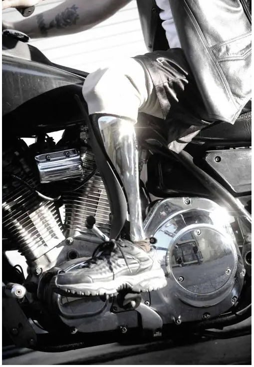
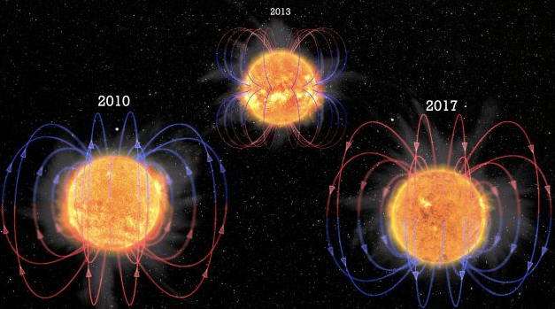
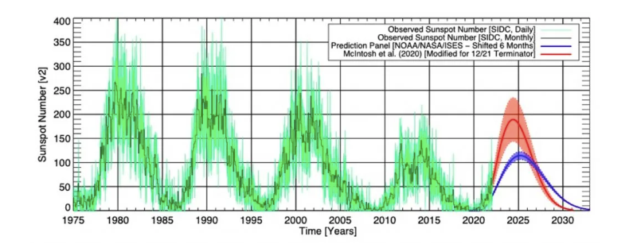
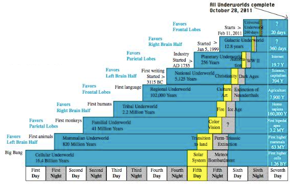

# NODE PUBLISH  
WIN24/SPRSUMAUTWIN25/26

## Publisher Note

GENERALIZED CIVILIZATION. CULTURAL GLOBALIZATION SO MANY WAYS TO DEFINE THIS Humanity, SOMETHING THAT SHOULD BE ONLY CONSIDERED AS ‘MADE or EMERGENT’; ‘made by ‘what’ or emergent from and for ‘what’, We do not know, if ‘Made’ either! A “Planetary Consciousness is in the realization.

THIS SEASONAL PUBLICATION DELAYED FOR 4 SEASONS (1 Planetary year) DEMANDED Time(s) THE INDIVISIBLE INDIVIDUAL IS IN GREAT DEMANDS OF ATTENTION, FROM DNA ALTERATION, ‘One’s & Zero’s’ EMANCIPATION, LEVELING Biology ENDURANCE… OR SOMETHING LIKE THAT, THE ANSWER BE SYNTHETIC, LET IT BE SO, IN A WORLD WHERE DIFFERENCES AND SIMILARITIES BLENDS INTO REALITY, OUR STAR THE SUN IS HERE TO REMIND US OF THE WHAT OF LIFE. THE PLATFORM ENTER .COM MODE THIS Year, IN THE MIDST OF AN EXCURSION WAYIN SOLCYC25 (the cycle that just don’t happen), THE RETURN OF Shamash, IS A REMINDER, BUT IN THIS PRESENT WE SHOULD SIMPLY WRITTE THAT IF ‘We’ CAN’T READ PEOPLE’S Mind. BUT We CAN SURELY FEEL THEIR THOUGHTS. TO KNOW THIS IS TO KNOW MUCH, AS FOR EVERYTHING ELSE, IT WOULD BE LIKE ASKING WHY THIS PAPER IS PUBLISH THE 25TH OF April. THE PATH IS NARROW, BUT A FIT FOR THIS Humanity.

A Planetary Consciousness indeed THIS IS NODEPUBLISH WIN24/SPRSUMAUTWIN25/26/ The Return of SHAMASH. GOOD STUDY AND GOOD READ.//

THIS PUBLICTION A TIME TRAVEL EXPERIENCE. 
### STARTING Winter 2024/2025 to Spring 2026// 

### “The Pineal Gland, wrapped in a ribbon like an Easter Egg”  ALL CREDIT IMAGE || [CANVAS A.I.](https://www.canva.com/)

**Preambule: Dissociation of a Kind**

Encompassing 4 Season’s (1 human Year) from last NODE PUBLISH publication Winter 2024/2025 (we did not publish content before, well, just because) You will find a lots of Anton Petrov, the usual pass-by the ‘glooms & dooms’ if any left, “the Tim’s” Regnier/Chalamet/Ferriss, All ‘the Mind’ on the subject matter, the Sun and the influence of Magnetic on morphology and other Biodynamic Resonance, with Q&A’s on Physical or Sub-At particles level event (WTF), all Podcast on “The Consciousness prevails” thing, JRE, Lex, DOA, Paper and Interview You need to read/watch or reread/rewatch herebelow, all of course not at the expenses of ‘The Arts’, in the Cinematographic part of Life 3 stand out right on Time(s), David’s FOUNDATION (Asimov on the small screen), Jacque’s DUNE (You didn’t had to, but You kind of had to!) and Jared TRON (bringing Silicon to Carbon, Man! nice, very nice), the Art of Body Parts is back with an overview of what Aesthetic Biomechanical does best, ‘the’ Biochemical always an interest, scrolling through 2025 SOUND a Musical experience with the H.O.D.T.’s with a selection from the ‘digital beat’, side tracked by Tempo (kind of) the SOUNDSearch Year 2025 Artist ROVER, loads of Anticipation Films and Tv Story all in consciousness of Our Time(s), and the usual ‘what the Internet does best’. Encompassing 4 Season’s and a 360 degrees (plus 5) spin, starting like it ends, this Publication is a time trip.

But before we re-begin, just to set the records strait, the Death of CLEON Dawn, Day & Demerzel, live from Your screen!

[**Foundation - (S3E10) | Apple TV+ | FilmongerTv**](https://www.youtube.com/watch?v=U2ec-CZSOtc)

 

### **Closing Autumn 2024 December 20th 2024//**

## NODE PUBLISH

**The Spiritual Scout**

The Spiritual Scout. The term is new, we should write ‘invented’, it describes Our ability to foresee Past and Future of “Our destinies” (read here personal & common experiences) by means of ‘Plausible Exploration’ in Space & Time, a natural ability granted by Time(s) (evolution whatever!) to ‘The Being’ which here should be understood as an ‘interface function’ of the Interface’s nowadays name “Self”, think of Yourself and if an Image is needed to comprehend, the best we found is that of a Memory We All share in the form of Lucid Dream, an emancipating Act(s) You made or participated to or witnessed, You remember the ‘feeling’ Cognition all in, and re-experience it from time to time. ‘The Spirituel Scout’ task is to enable the Self to Do both, find its way to Live and accommodate the Mind for anything new or deviant from what the Mind is used to (a bit of novelty theory), with an extra “trick”, the ‘Spiritual Scout’ is able to find the best path throughout Life, or Time in before real-time, toward the (in this case Ours & Yours) best Future, best to be understood as ‘most compatible with the state of You at the moment of decision’ (yes You where, Are and will Be in charge of Your own Story), promoting the value-life of what Your Self-interests to experience by mean of wish, desire, or phantasm a.k.a. “Ideariosity” (ideas and curiosity colliding), and inability to reach for it, all that reality You unlikely Anticipated, whatever “it” is for You, from things to immaterial. So why to name this ‘the Spiritual Scout’?!? well, of the 3 states of Dimension expereinced by Us, Soul, Spirit and Body, Celestial, Spiritual, Physical (heave it your way) it happen that the part of You the most able to achieve that task is ‘Your Spirit’ a.k.a. what fuel Your Self to Be.

Things appears to be changing, from Cosmos to Bios, his Platform grant all known aspects value, but the attention in on Our Star, the Sun. Hence our interest to Publish on WEB ( the communication system of a Planetary Society at the Dawn of 1. Civilization) things and continuously about Earth changes Affects and Effects on ‘the All & Everything Planetary’.

This world of Human is observably changing, All in Behaviors on anything O.I. (Organic Intelligence), Behaviors observed with a ‘Scientific Mind’ deconstructivism for tool, a curious Mind, as more and more often We see Ourselves morphing into the fabric of Entropy, the Spiritual Scout, Our best Self representation, above Us All, Our Star, the Sun, disseminating the Will of a Cosmos awakening. This is the NODE PUBLISH WIN24/25.

[**The HOB Selection| Lu Heng’s 2024 ITW speech**](https://www.youtube.com/watch?v=184l2Ktz1Q4)

 

### **December 31st 2024**

**preFaced :&#92;**

2025! What to write about? So much ahead! Solar cycle 25, SOLCYC 25 in 2025, if anything, a Year rich in what can only be described as “the Edge of the Age” title of an old publication of ours. Or is it the Dawn of another Time(s). Most did not notice but Art, Human Arts in its most contemporary forms stretch from Pre-Antique to nowadays LLM’s latest neorealistic image (not mentioning the art of assembling these llm’s), this Year is closing, this NODE PUBLISH propose a selection of recorded Artist or ‘self-published’, a pass by Body Arts under “required mechanical action” biomechanical prosthetic have warp the last 10 years, Creativity at Work in all ‘digital stuff’, yet carrying on the most common and ancestral form of Art, Tatoo, the Imaginative side of this Humanity is strong, no doubt.

Our Star the Sun change in Chemistry (rather its influences whatever this mean) Effect and Affect, on Earth Chemistry (Biome) and the everything of Life in it. So, 2025 papers Science lead the way, with a wave of Science exploration supported by ‘the bit’ is at its peak with a ‘sudden’ Common interest on anything ‘Magnetism’ through which doors this Planetary Consciousness will open to something new (spoiler, A Universal Consciousness). This Excursion maybe becoming Cerebral to Us, but how to remember the very changes of Us?

[**Michael Levin on Curt Jaimungal PODCast**](https://www.youtube.com/watch?v=c8iFtaltX-s)

**Collision Course**

Availabilities & Accessibilities, Conflict of Intents all over! This Humanity is about to enter faster than Light velocity, in Thoughts and Space onboard Galactic ship Milky Way, without noticing it, the Spiritual Scout memory alert, yet the interest is somewhere else, somewhere so ‘Societal Human’ that it is available from the palm of Your Hand, delivering the fastest & latest of everything Planet Earth. No, Human Attention is not on the Celestial dome (-372D2Artemis) or ‘the Spiritual You’ but on Human Affairs, or what Human’s do. Thing is, revelation have the deck stacked for continuity (You know time, thoughts, experiences) Energy must not Die and by transmitted from one act to another. 2025 will be nothing but business as usual for Earth, but a very transformative one for Humanity, fortunately Our Star the Sun is about to remind Us of the current Time(s) count, We ow Ourself by now to extend Our vision to wider (much wider) Attentions on Human ‘things’. The Epoch demands it.

|| overheard in a barber shop | …DANCING IS LIKE ANYTHING ELSE, YOU CAN’T FUCK IT UP,… SO YOU TAKE CLASSES ||

[The H.O.D.T.’s | Year 2025 Artist || Rover | Aqualast](https://www.youtube.com/watch?v=KntRrH_pnUE)

**Intent(s)?!?**

About the same, globalAIsation soon to be rename from its current tag Synthetic Intelligence unto what it was from scratch, Human made Fast Access to Memory Machines, and the smallest it will get, the wider that Consciousness will reach-out, not ‘expend’ it is already Universal, so are You, what is needed is a reaching point! “the light in the darkness’ (yhep bro’s things they are changing). The mentioned collision course must be approach as such, a Multiple of events demanding a multidisciplinary and multidimensional Mind, enable to know what is in Existence thus what is available and access it.

And the End. You are in no position to access what You do not know the existence of, this work for materialistic, experiences and know-how this world of Human hold. Not easy to access the everything of Existence and likely unnecessary by now. The Spiritual Scout an Hand on the “Human Tool Kit” (TMK circa 2002), the Cosmic changes of Magnetic Nature ongoing are surely inviting changes down to the Atom, will the Indivisible Individual continue roaming Planet Earth with an ‘experience freak’ mindset, slowly moving toward Universal knowledge. Or is it the story of an Entity realizing the variety in Visions, Dreams and Believes of it’s Own Kind.

**World of Worlds|| Writer Whitney Webb || HOB Selection**

[|| Whitney Webb on The Kim Iversen Show //2025](https://www.youtube.com/watch?v=DvW2PVKOqPI)

[|| Whitney Webb on Tom Bilyeu// 2025](https://www.youtube.com/watch?v=s7pSoM2mEnw)

[|| Whitney Webb on Peter McCormack// 2025](https://www.youtube.com/watch?v=EwejUh3m9Fg)

**The WEB of Webb.**

‘Indeed Programs’ (TRON quote), the Mind, which we rarely mention on this Platform, is to be reminded of its necessity (Necessity to Availability), and ‘those days’ knowing as little is as important, this experienced connector, bridge to the Organic Interface plugged-in in anything from Consciousness to Cognition, after all Memory and Intellect may just be as trained as the language module We so commonly use nowadays, exception is that the LLM’s in questions are polyglots therefore able to ‘think’ (the Thinking Mind) in multiple Human dimensions, from Culture to how You make choices and assess the consequences ot it(not responsibilities) a.k.a. ‘The Self’ is able to do for a fraction of Energy (whatever that thing is that fuel You), and will endure the foreseen process of what is now known as Earth Magnetic Excursion ‘EME’ not so far in reach to possible ELE’s (do not worries something will survive), which of course takes Us to Human Lineage and the very realities that entire Lines of This Humanity dating as Old as This Planet are vanishing from existence literally. Can this be avoided?, consciously avoided? Does the ‘Conscious Being’ withhold the needed functions, in Mind, the ability to organize the 50 Trillions something Cell’s Organism and do so via Consciousness, or simply put, knowing what the hell You are doing with Yourself! And apply this to real time acts, all ‘based on an accessible resources economy’.

|| CAN WE AGREE ON ONE CONCEPT, …THAT WE ALL WAKE-UP EVERY MORNING BELEIVING THAT WHAT WE’VE LEARN YESTERDAY CAN’T BE TRUE, … AND THAT WE GO TO SLEEP EVERY EVENING WITH MORE INFORMATION’S TELLING US THAT IT IS REAL!||

[Year 2025 Artist || ROVER | Sound Search | Some Needs](https://www.youtube.com/watch?v=odfWhNVYBko&list=RDodfWhNVYBko&start_radio=1)

**In All Human Bourgeoisie (.2)**

“All of it to Eat in a better cafeteria and purchase the latest desirable branded goods”, We only wish so, ‘blasé’ are those things We all know or expect to be about any Civilisation Ethos vaguely emancipated under the tag “Elite” Aristos or not and what not! But never speak about. The very first Planetary wakening is at work, nothing Mythical, this We already Own, the wakening of a Kind is on what Greek Philosopher described as “The Ethic”, the studies of moral principles and behavior, demanding ‘standards’. Here You get it, if We can’t identified changes in behavior vs. standardization of moral principles, it gives Us a timeline indicator of Biological Nature that has been recorded before, Human or not, All the living is an continuity of another Life. Or is it! The openness to ward multiple Dimension is as well lacking of Imagination, Imageries inexistant, yet the possibilities that ‘this reality’ is a plain all Life arrived into from another dimensional (space and/or time) could become more than a theory.

The WEB has been good to Us, so much We can share and search at Will at any time anywhere, this Planetary Communication system is providing with the very basic it was provided and designed for, and this Planetary Civilization in the making is now interconnected ‘Humanely’, for best to worse, and it becomes very difficult to escape its broadcasting knowledge. ‘the Internet’, like every communication medium before, have its Legend, we choose Legend because that is what is is, Entities understanding by mean of observations the Act(s) Nature and of other Entities, making it available for knowledge. So far nothing out of the ordinary, the cue is on Humanity and Humanity Future, for which, either by plan or total unconsciousness, every element’s available to achieve an Ethical Society exist. The issue of course is ‘direction’, understand here “who is in charge” of what this Humanity is and could be, we often write that a total lack of imagination is the cause, extend it to Your Self. You are not exempt of existence and what makes it, so when an opportunity to know what this Humanity is made of arise, choose to know, disregarding the opinion You have on Life.

‘YOU CAN’T READ WHAT PEOPLE THINK, BUT YOU CAN SUREY FEEL IT’ Etr\\ National Library of Medcine\\ 2025 Publications \ DISCUSSION | The possible influence of the geomagnetic field on human health has been discussed by scientists over the past decades.[[31](https://pmc.ncbi.nlm.nih.gov/articles/PMC12005662/#R31)] Some epidemiological studies have shown that extremely high or low GMA levels may have adverse health effects in susceptible populations.[[32](https://pmc.ncbi.nlm.nih.gov/articles/PMC12005662/#R32)] Human is born, grows, constantly resides and develops in the natural electromagnetic fields of the Earth. Studies show that certain physiological processes and functions of the human body have circadian rhythms, and the Earth’s magnetic field can affect them. Cyclical processes in solar activity, such as the appearance and disappearance of sunspots, as well as seasonal weakening of the geomagnetic field, can affect human health through influencing to physiological circadian rhythms.[[33](https://pmc.ncbi.nlm.nih.gov/articles/PMC12005662/#R33),[34](https://pmc.ncbi.nlm.nih.gov/articles/PMC12005662/#R34)] At the same time, many cardiovascular parameters demonstrate daily variations corresponding to the circadian rhythm.[[35](https://pmc.ncbi.nlm.nih.gov/articles/PMC12005662/#R35)] Geomagnetic fluctuations, especially GS, negatively affect (disturb) the synchronization of the body’s normal biological rhythms.[[36](https://pmc.ncbi.nlm.nih.gov/articles/PMC12005662/#R36)] Therefore there is evidence of the relationship between GMA and heart rate variability.[[37](https://pmc.ncbi.nlm.nih.gov/articles/PMC12005662/#R37),[38](https://pmc.ncbi.nlm.nih.gov/articles/PMC12005662/#R38)]|| [study here](https://pmc.ncbi.nlm.nih.gov/articles/PMC12005662/)

[PLAYList Artist 2025 | ROVER | chosen piece | Sodade](https://www.youtube.com/watch?v=k8feVN0hNAQ)

**the return of Sun**

Compromission, Compromise, Compromised, the lineage if this Word is the contender of the 21st Century. This search, the NP’s Publications born from consequential deplatformation “lol”, only changed its Name, not its lineal content nor editorial lineup, Our papers published at Season closing have, does and will provide with an O.I. view point on what the WWW does best, disseminating the required knowledge build to ‘enhance’, sort to speak, this Humanity view point on itself, this Planet, this Verse and realities, Planetary Civilization in the making has we usually like to refer to it, and by “compromise” what we mean (a better Word for Thinking in that specific case) is what We leave behind, in Kind and kinds. And the ‘negotiation’ is between Us, Human’s, and only Us. Disregarding any ‘ethereal causes’ and every ‘Dimension Probabilities’ and their “Being’s” included, this decision is Internal, Introspected, and Individual. We must accept Our presence and refine Our Humanity. Issue is in the dissemination of available knowledge and accessibilities to Experiences, ‘the’ Time(s) & ‘Your’ Consciousness! Consciousness is Our most unvalued ally, and that Consciousness we write about is that of a Universe, a Universal Consciousness is demanded in order to gracefully move on into a Spaciotemporal experience all by Willingness (think Choices) and the understanding of what We ‘leave behind’ and what shall Imagine for Future. In a Time(s) where Sound and Noise are merely differentiable This Planet Magnetic presence may just become handy, of course conditions apply, Intelligence and Abilities in the pocket, all ‘Tools” needed at Hand to Transcend, Biologically. Enough to keep You busy, good read and good study, this is the NODE PUBLISH closing the first quarter of the 21st Century CE. – the Return of Shamash, SolCyc25, but before we continue, good Words from the Suspicious.

[**The Suspicious on Matt Beall,**](https://www.youtube.com/watch?v=z8asS7yLpHk)

Potential influence of geomagnetic activity on blood pressure statistical fluctuations at mid-magnetic latitudes|| NATURE Publication || Ext Based on existing statistical data, it is challenging to ascertain which gender is more sensitive to temperature or PM2.5 levels. As shown in Supplementary Figs. [6](https://www.nature.com/articles/s43856-025-00822-w#MOESM2) and [7](https://www.nature.com/articles/s43856-025-00822-w#MOESM2), the correlation between BP and air temperature follows a more nonlinear pattern, while the correlation between BP and PM2.5 is linear. For both air temperature and PM2.5, females in Weihai showed higher correlations, whereas males in Qingdao had stronger correlations. Therefore, we are currently unable to draw conclusions about gender differences in the effects of air temperature and PM2.5 on BP, and future research requires data from more cities. The occurrence of two peaks each year and the 6-month periodicity of GMA can be attributed to the occurrence of strong geomagnetic storm events that are triggered by the Interplanetary Magnetic Field (IMF). These events have a higher likelihood of occurring around the annual vernal equinox (autumnal equinox) when the IMF is aligned toward (away from) the sun. This mechanism is commonly explained by both the Russell-McPherron effect and the equinoctial effect, which are widely accepted in the scientific community[60](https://www.nature.com/articles/s43856-025-00822-w#ref-CR60),[61](https://www.nature.com/articles/s43856-025-00822-w#ref-CR61),[62](https://www.nature.com/articles/s43856-025-00822-w#ref-CR62). The influence of GMA on human health is believed to be mediated through direct or indirect pathways[63](https://www.nature.com/articles/s43856-025-00822-w#ref-CR63), with one potential indirect method being through primary effects in the brain that cascade downstream via the vagus nerve. Future research is required to collect the patient data where vagus nerves were removed/severed surgically (or inhibited pharmaceutically), with the aim to explore the role of the vagus nerve in mediating the effects of GMA on BP. Additionally, previous research has found strong correlations between Schumann resonance signals and GMA indices, with both exhibiting common periodicities such as 27 days, 3-month, and half a year cycles[64](https://www.nature.com/articles/s43856-025-00822-w#ref-CR64),[65](https://www.nature.com/articles/s43856-025-00822-w#ref-CR65). One possible mechanism explaining the effect of GMA on BP involves the modulation of ultra-low frequency waves, specifically Schumann resonances and their harmonics, which occur within the Earth’s magnetosphere and ionospheric cavities.|| [Continue Study Here](https://www.nature.com/articles/s43856-025-00822-w)

### [**ALTLimbProject**](https://thealternativelimbproject.com/)

**Forbidden Biomechanics**

Could This Planet be kept ‘alive’ by mechanical means? Wannabe ‘Android’ is all over the place. Synthetic mobility amaze, on a screen first then likely you will (or have) come across the ‘tool’ in real time, double dose of amazement, Biomechanics is a “Thing”, and our focus have been on it for a while, from our view point, this Platform Act(s) for. Planetary Civilization and an Ethical Humane Society, the stand is easy, and can be resume in few words.

“imagine a limbless person, enabled by biomechanical force, becoming more able than a ‘valid’ person (Welcome to Gattaca), the revelation itself would be unacceptable, a society reflecting ‘competition by selection’ (availability/accessibility) as its standoff model could not accept enhancement. Point is, that all limbless persons carry an ‘above than average’ Will, Fear deconstructed to the Bone. And here is a true Human opportunity, providing with a Mindset only They have earn. Boosted by Mechanical Power. Potent mix”

From our last NP’s Publication we will only write that Consciousness have cost in All things but most of all in Human cost, the necessary ‘sacrifice’ some demand so their ‘dream’ can be realize only justify the question of ‘Progress’, in value Consciousness added to experiences in a Time(s) frame short enough so communication on the ground about the conclusion help this Planetary Society to adjust on a day to day basis, in quality and trade are now irrelevant the simple aspect of ‘societal success’ promote anxiety to the ‘victor’ demanding how few can extract so much and for what, immobilization of Human capital remain the number 1 factor of control! Consciousness rules are unknown,

EXT || Disability Horizons 2024 Publication || Prosthetic limbs have come a long way since the 16th century, when ‘the father of prosthetics’ Ambroise Pare started practicing in France. From running blades to 3D printed limbs, it’s now possible to pimp up your prosthetics as much as your car or wheelchair.

With artists and industrial designers getting in on the act and creating one-of-a-kind pieces, bespoke prosthetics are fast becoming popular, while 3D printing is also making prosthesis cheaper for those who don’t have thousands to spare. So if you want to upgrade your look, or start taking part in a new sport, here’s a list of our favourite prosthetics companies, artists and pioneering designers.||

Human capacity is to be harvested to the extend of the visible Verse, not to the ‘knowable’, and Human enhanced Biomechanically will benefit a Humanity in great needs of expansion, in Abilities & Capabilities. Consciousness is delt with on a Jiffy basis by nearly 9 Billions Human Beings surrounded by Trillions of Beings (name Them Animals & Plants), All resonating with the current Magnetic state of Earth & everything Cosmos, Walking on a Silk string, hanging at the Will of a Star. Shamash, so named by somewhat this Humanity Ancestors, Sumerians, is returning in Millennium fashion for what is known among Human’s as the Solar Cycle 25 since it is the 25th Cycle observed, with an average of 11.9 years, say 12 Years per Cycle at Sunspot count, and for Its return, a plenty of new Particles disguised in ‘Wave’, say gift from SgrA (the Galactic Center). What a Mouthful.

Is it needed to remind the Reader that this Platform attention is on this Humanity, or should we write, this Humanity Future, capacity to Imagine and ability to Realize. Planetary is the key word, a Planetary Civilization, whatever this mean, Our Medical capabilities and capacities have augmented that much that a Societal discussion is needed, asking if the Bio is to morph with the Mechanical, demanding ‘civilization’ to be refined or redefined, but maybe this is a great opportunity to move away from this ‘state of mind’ or thoughts have it Your way. Knowing for which ‘state of mind’ We would let the common one goes claim would be good, but can We Imagine it? Time(s) is what it will demand and We run out of each second, Consciousness Realization override so by necessity We compensate in Behavior. As per the question “what if this Planet is hold artificially stable?” then We would commonly have to ask, by What?

“LIKE RAIN, THE SUN SHINES ON THE JUST AND UNJUST ALIKE. BUT THE CONSEQUENCES CAN BE DISCUSSED, YOU’LL ENDUP CHOOSING RAIN ANYDAY…”

**Archetypes and Exceptions.**

The Creation of this Dimension if anything has been Complex, from Science view point, rude would be a good term if not always associated with attitude, Difficult comes to Mind. Lets suppose that We can take the last 100 Years of well recorded Human History as “potentially accurate dp’s”, 1900’s Speciation, Bionation,Psychonation, 1950’s Ultrapsychonation, Sublimation, Augmentation, 1970’s Contemplation 1990’s Selection & Activation leading to Present Realisation, throw in a little satisfaction by acquisition a.k.a. Globalisation of the Mind (30 years since the W3C inception) and here you are, the World of Human at Your Hand! And what do You do with it, You look for expeption & follow archetypes, the evolved product of Millenia of Human presence on Earth. How We came to be remain the major subject of discussion to date.

The Test was simple enough, within a social group (social as in between Human’s nothing Political), say a Globalized Social Group (Planet Earth), you implement a subject with the aim to collect the ‘crowd’ attention, from merchant’s to power players, and promote a program which will have for purpose only to take attention away from, not give to! Test of Attention or where is Your interest. Nothing propose a Vision simple enough to be understood and imaginative enough to be accepted. 2025 was the ’Conscious Neutrality’ best year so far.

We could begin by an Act(s). The cost is in Human, used and use strangely supporting so few aiming at their own Mind so they can come to the conclusion of their experience whatever the cost in Matter, Emotions or Blood is! Or we could begin by a quote, one which emerged over the last Seasons;

[“Being a Human in 2025 Is Just Vibes, Wi-Fi, and Mild Anxiety”  from UnatiDadlany a MEDIUM Publication](https:/medium.com/@unatidadlani0/being-a-human-in-2025-is-just-vibes-wi-fi-and-mild-anxiety-99cf8c25f74e#id_token=eyJhbGciOiJSUzI1NiIsImtpZCI6IjkyN2I4ZmI2N2JiYWQ3NzQ0NWU1ZmVhNGM3MWFhOTg0NmQ3ZGRkMDEiLCJ0eXAiOiJKV1QifQ.eyJpc3MiOiJodHRwczovL2FjY291bnRzLmdvb2dsZS5jb20iLCJhenAiOiIyMTYyOTYwMzU4MzQtazFrNnFlMDYwczJ0cDJhMmphbTRsamRjbXMwMHN0dGcuYXBwcy5nb29nbGV1c2VyY29udGVudC5jb20iLCJhdWQiOiIyMTYyOTYwMzU4MzQtazFrNnFlMDYwczJ0cDJhMmphbTRsamRjbXMwMHN0dGcuYXBwcy5nb29nbGV1c2VyY29udGVudC5jb20iLCJzdWIiOiIxMTA2OtgxMDgyMjU0MzcyNTY4NDMiLCJlbWFpbCI6ImhvbWVvZmJvaGVtaWFuQGdtYWlsLmNvbSIsImVtYWlsX3ZlcmlmaWVkIjp0cnVlLCJuYmYiOjE3NTg1MzgyNDcsIm5hbWUiOiJIb21lIG9mIEJvaGVtaWFuIiwicGljdHVyZSI6Imh0dHBzOi8vbGgzLmdvb2dsZXVzZXJjb250ZW50LmNvbS9hL0FDZzhvY0pYWWlKRWVVQy1fVG9rbV8ybDIzdks0LXVrVWtJR2paLVdzX2t2el9TsjByTlJ5ckhsPXM5Ni1jIiwiZ2l2ZW5fbmFtZSI6IkhvbWUiLCJmYW1pbHlfbmFtZSI6Im9mIEJvaGVtaWFuIiwiaWF0IjoxNzU4NTM4NTQ3LCJleHAiOjE3NTg1NDIxNDcsImp0aSI6IjBlNTJkYWFkNWU2N2M5OTdjNTZjOTEyMmUyMTkxZTJlMWJiNTcxNTIifQ.gQHtQeVHdAKLHRGzAENXMXaTeZ9pohWC4JFk9ag_H1CpibtRGbxNh4CwrZdJKkK_ASO6DNkk4BnKZ1L9VfPvSmrXMzCAoxzVgDEThz7RDQ7CI04JsoPoJars-8aNaiEtwUZEHzPUvFgzKoeBCPrfaQwM3MumA-8ukLMayNQH9hPvxltmGCFuyUpHkFMR7-lnW89AwFhCAg4mA9l1Bpen7wK4wFnsKE-prDS_gaPZA8TsySAsZfdV_TuXMnqGqySdqux-FlzYmo02viRmkCYhTIG0PiqYZcU3n7LxP1wmPwjsncXen-HTcn2-wqLw4xmMXom1Rc_Toh1GfwbGQr66gw)

**Sun’s etcetera || study**

Human fields and their impact on brain waves |A pilot study| ARXIV Publications\\ Discussion| This work has several shortcomings. First, all the test subjects (Intervention and control) are undergraduate students, meaning they represent a very specific segment of the population. Second, although the results appear statistically significant, the sample size is relatively small, comprising only 30 subjects in the intervention group and twenty in the control group. Finally, and perhaps most importantly, we cannot control the thoughts and feelings of the subjects during the experiment, which may introduce a significant source of variability.

Care was taken to ensure that the test subjects were not under any medical treatment of any kind. However, several records had to be excluded because they were classified as outliers, with values far beyond the expected range. When interviewing the outlier subjects, two reported having recently experienced the loss of a loved one. Another said his girlfriend had recently broken up with him.

It remains unclear whether the psychological states reported by these outliers caused the substantial increases in the amplitude of their EEG readings or if this was merely coincidental (see figure 2). Moreover, other outliers reported no psychological conditions deviating from the norm, yet their EEG-derived PSD values were far outside the expected range. || [Continue reading here](https://arxiv.org/html/2502.01939v1)

### [IMAGE ALL CREDIT// NASA](https://science.nasa.gov/blogs/solar-cycle-25/2022/07/27/solar-cycle-25-is-exceeding-predictions-and-showing-why-we-need-the-gdc-mission/)

How Solar Eruptions Can Impact Mental Health| Exploring the Connection|| by The Jem Foundation Publication| Solar eruptions are a fascinating yet often overlooked phenomenon regarding their potential impact on human health and well-being. Known scientifically as solar flares or coronal mass ejections (CMEs), these intense bursts of radiation from the sun can affect Earth’s magnetic field, disrupt communication systems, and, intriguingly, may also influence human mental health. In this post, we’ll dive into what solar eruptions are, explore how they might impact our mental and emotional well-being, and discuss ways to navigate these cosmic influences. || [Continue reading here](https://thejemfoundation.com/how-solar-eruptions-can-impact-mental-health-exploring-the-connection/)

//A.I. MODEL DIVERSIFICATION IS ALREADY HERE, INTELLIGENCE IS IN EVERYWHERE IN EVERYTHING, AND WE HAVE LEARN OVER MILLENIA TO TRANSFORM THIS EVERYTHING TO MAKE IT USEFULL, IS CALLED THE SOCIAL TOOL KIT// ||TMK quote//

[**Magnetomicrometry-Based Control || MIT Media Lab ||**](https://www.youtube.com/watch?v=bU2jEA6u2rk&time_continue=4&source_ve_path=NzY3NTg&embeds_referring_euri=https%3A%2F%2Fnews.mit.edu%2F)

From MIT BioMechanic research\\ Precise measurements With existing prosthetic devices, electrical measurements of a person’s muscles are obtained using electrodes that can be either attached to the surface of the skin or surgically implanted in the muscle. The latter procedure is highly invasive and costly, but provides somewhat more accurate measurements. However, in either case, electromyography (EMG) offers information only about muscles’ electrical activity, not their length or speed. || [Read it here](https://news.mit.edu/2021/magnet-prosthetic-limb-control-0818)

 

### **Early Spring 2025**

**The State of Us!**

So, what did We learn? Or should we write what do We know, we mean Commonly, as Human Beings. Well, first of any list is that Life, “the Life”, is fragile, very fragile, yet each living thing have developed a potent survival mechanism enabling a ‘process’ call time to unfold, event after events, intellectually plan or not, demanding information to act and\or react accordingly. For Us, Human, the current task is to realize that You are the product of Billions of Eon’s of Cosmic Time(s)! Or not, Our way tends more toward ‘time compression’ and ‘time dilatation’, accept that You may not Live in the Time(s) You are told. For the reader to know, this segment is by far the longest this Platform ever produce on the subject of Reality, just lazy. Are We willing to let go of Our reality in trade for another? we are not talking living-room do over or moving to “another country”! But the very reality of Time(s) Dimension and how it pounder on anything living. Or! are We interested to make this one Our own, and act accordingly. A Vision is needed.

The space We experience, as pat of “the known Universe”, is peculiar, say ‘unique’, Earth, Air, Water and Fire forming this Dimensional Experience “making” Consciousness possible. PAUSE; Nowadays altered consciousness is a requirement to move forward, behaviors appear to be shifting. But it maybe just a miss-observation, the possibility is that all systems are becoming obsolete (the deconstruction of Matter), if taking in consideration the interests Human Beings have in Life with a 21 Century Mindset, experiences transmitted over time on the social ground are soon to be flooded by ‘the everything celestial’. A Universal Consciousness for what? An answer is ‘to grow’ in realization, foreseeing consequences for One and All, the subject matter herein is of course that of how We commonly learn from experiences and use the memory of Our learning, modern questions such as; does learning always have to come from pain and sacrifice? Or; does the Human environment created for professional purpose, what is know as Working environment, is to remain traditional in its ‘inclusion Philosophy’? Or again; is it needed to bend anything instinctive to gently fold in a mold? So many possible and so many realistic thoughts that it’s easy to get lost in Our own Head say Mind, Universal Consciousness work as such that You really become the center of Your Universe, yes however Your feet touch the ground You are not attached to it. Human Workforce is so misused that the ongoing discussion about other Worlds, other Beings, and so on almost become legitimate. How long before This Humanity, the Bio-Entity awaken.

What is endured for You to ‘grow’ consciousness? The reality of Our Biology is cold and unmerciful, Transcendent, yet, and supported by millennia of records and deposits, here We stand, Human’s, Singular, the Indivisible Individual exploring furthermore the Earth experiences less than ‘10 light speed minutes’ away from Our Star, Superposition is the word of the past Decade as in superposition of ideas, and this Humanity, ‘dreaming’ this reality based on intemporal memories experienced in a temporal consciousness somehow provide with a last opening, curtain just about to fall, Solar Cycle 25 or SolCyc25 is here. But before we move on with which event supersede which event, and despite the total lack of Theories on the subject, we must accept it, Human, Beings of Earth are changing, in habits and ‘resonance’ (sort of), this will be the subject of the NP’s closing Spring. But for now, all Our attention is focus on the Star next door, the return of Shamash, Solar Cycle 25. Before year end We will know if Our believes are more real than Our disbelieves.

The Glooms, the Dooms… and The news|| the HOB selection| SPR25

[**The Day Earth Turns Upside Down|| SO || MBLimitless Clips**](https://www.youtube.com/watch?v=hVLOu19Vxvs)

[**Sarah Wilson | TEDxSydney**](https://www.youtube.com/watch?v=l7Ay73HHHrE)

[**The Imminent Magnetic Pole Shift (2030-2050)|| The Bevestator**](https://www.youtube.com/watch?v=sfoqSpoKHwQ)

 

### **Late Spring 2025** (somewhere on an Atlantic Coast)

**Classified**

This Platform do not verse into Politic much, neither anything Religion nor Military, but these classifications, however abundant in all forms and extending to ‘the Societal Human’ by mean of ‘social class’. Appear to dissolve without leaving traces in the Common Memory, ‘how things used to be’ is by far the chatter of any Human society everywhere on Earth. ‘sound’ is the Word You are searching for, as in “is this assumption sound?”, and You are right to question it, if things are shifting, We, this Humanity, should be able to grasp all bouts and accordingly level what can only be described as ‘the same boat’ as the adage goes. That ‘.01%’ of Life We don’t commonly experiences is ‘3.2 Million base Pairs away’, Permutation, Transformation & Mutation just won’t do. Issue is of course who and how anyone could action a ‘virtual’ system to “Elevate Mindly” this Humanity? which of course would demand the following question; to what end or purpose?

Contractual would be a good Word, the dissemination of Consciousness was, is and will remain the most precious ‘thing’ the classification of the Living will allow You to do while alive in the current State Of Being, and To Be conscious of it likely the most gratifying reward, but instead, knowledge occulted by fear of understanding, educating practice segregated to groups, and governing positions carefully passed-on to self-elected (Cults) and self-promoted (Familial) candidate, the societal classification is dissolving, and it does so very rapidly. Conscious Neutrality at Work, we did not expect that much that rapidly. Another ‘datapoint’ to be added under; things that We see change but can’t do anything about.

[**The Plasma Apocalypse[]the WHY FILES**](https://www.youtube.com/watch?v=PDQ4bFoUWGA)

|| FOR Humans THE ALTERATION OF Earth Biome TAKES US TO THE SAFE April PLACE. GUIDING Us TO ONLY ONE SOLUTION THAT REMAIN ‘Psyche safe’, THE CHILD. THIS IMMUTABLE BEING WITHIN US UNALTERABLE AND UNIQUE, THIS IS WHAT ‘state’ WE ARE SHIFTING IN, THE CHILD WITHIN US. SO WE CAN DREAM AGAIN. ||

[Santos Bonacci || Spring BREAK || RE-POST|| 2011 The Ancient Theology || Series Part 1 -](https://www.youtube.com/watch?v=SiCfWF_mIeU)

**Predictable Intents**

What is it, what is this invisible ‘thing’ flowing through it all? Magnetism (Intelligence in another form) as We all experience it from the first Division of Cell on Earth. Consciously at Youth, We usually play with its “magic” using a magnet set or just one and Metal. Later in Life some will attempt to control it as Engineer in the discipline of Geophysic or Cosmology, in real time Life We commonly experience it under the form of Electricity, ‘A Human Finding’ or how to control a Natural Phenomenon, Electricity is the chatter for 2025, or rather Who will have some and not, opening the way to new types of ‘Energy harvesting’ for Data usage with success or not, We will see. Others predict that this form of ‘energy’ can be harvested for Spiritual purposes, whichever is Your pic, it’s the good one, You are a Magnetic Beings (we couldn’t find better) by all measures, ruled by Magneto Reception, Earth being the closest ‘source catcher’ of this Universal ‘substance’ and Our Star the Sun the nearest interactive ‘influencer’ reminded to Us by shift from time to time under Our Galactic Mother a.k.a. Galactic Super Wave, gift of SgtA.

So predictable Humans Act(s), so why so complex to foresee Its near Future?! Or should we ask, why is it so complex to foresee Our options, in Vision and as much as possible a Vision not build on Past events, rules or decision building standard and manufactured Behavior, no Emergence in Human Dreams, as such, and in Time(s) of Excursion, a question should be asked, ‘why does Human’s changed so little over such a long time’, issue is ‘a standard to use as reference, to ‘decipher Chronos’. At the ‘near’ exemption of OX Gene we did not found any. Are We so Different compared to the Animal Kingdom examples?’, a subject worth a Conversation, of all forms of Art Human can abide by, Conversation is without a doubt one of Human’s unique attribute, the WEB of all things finally takes grip on the subject matter. Curiosity must be understood as a real-time change in Behavior. Which is taking us to Secret or secrets have it Your way, a concept that only exist as ‘a social survival tool’ for the protagonists, valid for Ideas as well (and the rest of Nature maybe), ways kept in order no matter the cost, but for good ‘Reason(s)’ as We are reminded.

For Human’s, for an Idea to survive it must be curated and refine most always demanding for ‘few things to be ignored’, and that, ‘it is best if it remain known by a few’, for sake of collective safety, and to make sur that “power”, as it is known, remain in the hands of ‘A’ whomever for whatever, most always not the parties via which the Emergent Idea in question emanated from (apparently secrets can be hold for Centuries) almost concluding that this Planetary Humanity have the ‘Cultural Elite’ it merit, but “Merit’s” have been relace by “Opportunity”, the Opportunist OX Gene maybe at Work. Difficult task nowadays to find Similarities in all those Differences, the rise of a Planetary Consciousness couple to a total lack of Vision from the said “Planetary Civilization” drag Us to a Society of opportunities, a vast subject. That the said ‘cultural elite’ know more than We can imagine! Or that every Fall of a Civilization comes from the suppression of Dream’s are socially known examples. What to do about it.

[NEW Discovery Foretells Mankind's FUTURE! | Gregg Braden || NSLPodcast](https://www.youtube.com/watch?v=jcU5N5TO8u8)

| YOU ARE CONVINCE OF 2 THINGS; THAT YOUR ENVIRONMENT DICTATE YOUR “GENES”, & THAT YOUR “GENES” DICTATES YOUR ENVIRONMENT. WE WILL RETIRE STANDARDS & SPECIFICS WHEN IT COMES TO “WHAT ARE WE?”, NEITHER YOUR “GENES” NOR “ENVIRONMENT” WILL PROVIDE AN ANSWER FOR IT |

**Familiarities & Vulgarities.**

“the recognition of individuality is what differentiates us from the heard. Human Family by Genes”. When it look like it, sounds like it, move like it and behave like it, ‘the’ Human Being differentiates itself totally and absolutely from what is known as ‘the Animal Kingdom’, nonetheless, animal like behavior, in Act(s) and Thoughts are plenty to be found in the dominion of the Conscious, Standard, a question of ‘Natural proportion’ as most tend to believe that whichever ‘animalistic behavior’ We have inherited from whichever Past(s) must be kept alive and kicking. ‘playing with Thoughts’ we write, and maybe that is just as well in contemplation of ongoing and yes ‘forcing’ events this Humanity is now awakening to. Magnetosphere weakening will be the chatter of the late 20’s, as in the late 2020’s, the Solstice is already here, Weeks away, and various other phenomenon begin to emerge, 2025 will close on Behavioral Mutation being one which All attention should be given to, this Platform fancy it, a Singular opportunity to Transcend it All,

 

### **Early Summer 2025**

## NODE PUBLISH

### **SolCyc25 in 25, how ominous | Ama-Gi**

**EVERYTHING IS STILL**

the return of Shamash, very little must be known, 1) that Our Planet Magnetic protection weaken, 2) that All living things depends on Electromagnetism to exist and 3) that there is nothing Human can do to avoid the Nature of Their Star but to ‘GO WITH IT’, flow in it or Transcend to it have ‘it’ Your way. The subject has been ‘vulgarized’ in order to make it acceptable in Layman, not so much that interests are now flooding the ‘internet’ L.O.L., but with the idea that a standard become familiar, not long before this just take-on the audience the momentum deserve. Behavior is the Word, as in ‘total changes in behavior’ by opportunity, now is ‘the right time’. The cause is not due to some diversion events, if more is known by some on the subject let it be so, the ‘events’ herein will be for All the same, only the “state of mind” of the moment will ‘dictate’ (yep harsh word but we did not found another) the Who becomes What, Behaviors are dictating the all and everything Human, so the transformation in question, hyper-opportunistic”, appear in shapes and forms as unexpected as it is unimagined, not a Spiritual one, but a Biological one.

Very little is known of Human’s whereabout. Of course trace of activities can be found, unearthed we should write, the rest is imagination, We can’t be in Time(s) as We like, Future is Our common destination in order for this ‘Biome’ to continue its own story, adjustment are made from time to time in order to ‘upgrade’ the Fauna and Flora of Earth, these time are known as Magnetic Excursion, and You are living in an event You should Be aware of, and apply the needed Mindset to prepare, not in stocks and shelters, but in Thoughts, and see the changes as You experience it, one opportunity at a time.

**Types of vision**

Shared Reasons by Groups and nowadays extended over a Planet under the Globalization tag#; World Wide Web, useful Planetary Communication System, foundation of the anything & everything Human, remaining the only Tool active today to enable one to make choices base on Differences & Similarities a.k.a. ‘what You don’t ignore’. ‘the Internet’ via the W3C for over 35 years, have been made Available and Accessible to the Human worlds, “nothing new, but what is not known” as the adage goes, asking what is in existence, discovered and studied, is another thing, the worlds of Human’s are often demanding efforts to be understood, from Farming to Quantum Physics it is clear that ‘the all and everything to know’ is the ‘merit’ of a few and Their Dreams, which must be render real in order to realize that it was not a Dream, but a desire guided by Ideas.

Next! The types of ‘vision’ in question is literal, how Your Eyes reveal the Universe. Light is the word You ae searching for, and for Us, Human of Earth, Light is made possible by a Star We commonly named (dig the HOB Waybackmachine to find the name list by Nation), a Class G2 Star, meaning it is a G-type star, with 2 indicating its surface temperature is in the second range of the G class, another system of measurement invented by Human Beings to describe what They see. Solar Cycle 25 is Our current Sun Cycle, numbered from the first observation of Sun Spots informing Us that Solar maximum is reach, a 11 something years process which is the time the total reaction makes from the Core to surface, Magnetic reversal or Galactic Wave Thickness impact have it Your way. And this is the conclusion of that segment, a subtle change in the Light Spectrum would be enough, it would reveal and make vanish things We consider as ‘Natural Standard’. Did such a thing ever happen, did Human of Earth already experience a change in the Light Spectrum, live, lucid and conscious, to see Their world change, in the blink of an Eye.

Ama-gi has been translated as "freedom", as well as "manumission", "exemption from debts or obligations", and "the restoration of persons and property to their original status" including the remission of debts. || source || Wikipedia

[**2-1 Exploring the Deep (cont'd)**](https://www.youtube.com/watch?v=UnELq1EfYcI)

“WE JUST CANT CONTINUE TO VIEW CONSCIOUSNESS AS ‘AN EXPERIENCE’. THE INDIVISIBLE INDIVIDUAL IS JUST THAT, INDIVISIBLE FROM IT’S Humanity AND Itself, YET UNIQUE IN ALL WAYS. THE ‘INTERFACE HYPOTHESIS’ HAVE GROUND.”

Pareidolia (/ˌpærɪˈdoʊliə, ˌpɛər-/; also US: /ˌpɛəraɪ-/). Is the tendency for perception to impose a meaningful interpretation on a nebulous stimulus, usually visual, so that one detects an object, pattern, or meaning where there is none. Interestingly enough, Our Epoch resemble no others, at least none that was found in any data, Empirical or Alternative, to provide with any clue of what is ahead of Us All, the Past(s) which ever happened then, will not reproduce again, only the ‘Source’ remain the same, like a mold, endlessly producing the same shape with whatever matter is poured into it, it is then easy to mistake one thing from another.

Solar cycle 25 is the current solar cycle, the 25th since 1755, when extensive recording of solar sunspot activity began. The current one began in December 2019 with a minimum smoothed sunspot number of 1.8. It is expected to continue until about 2030.

From NWS// Solar Cycle 25 in 25 The panel has high confidence that Solar Cycle 25 will break the trend of weakening solar activity seen over the past four cycles. “We predict the decline in solar cycle amplitude, seen from cycles 21 through 24, has come to an end,” said Lisa Upton, Ph.D., panel co-chair and solar physicist with Space Systems Research Corp. “There is no indication we are approaching a Maunder-type minimum in solar activity.” || [continue reading here](https://www.weather.gov/news/201509-solar-cycle#:~:text=Solar%20Cycle%2025%20is%20forecast,a%20peak%20of%20115%20sunspots.)

/UNACCEPTABLE MEMORIES, REMEMBERING! AND FEELING BAD ABOUT IT, BECAUSE WHEN IT COMES TO “RISING TO THE OCCASION”, WE ALL FALL SHORT.\

**In “PluriDimensional” Existence**

How did You get here? You likely got it, it’s a Universal version of how Human’s become to Be. However nowadays an ocean of Theories on the ‘what’ of Dimensions is propose, and whichever that Your Imaginary fold under, the proposal of “pluridimensonality” is unknown to You. So, we should start by acknowledging the Reader how transformative and probably Time(s) demanding (count in Billions of Years) it demanded You to Incarnate to ‘what’ You are today, the decision or not of a Female and a male to cooperated to start a BioChemical chain reaction. Our example is an easy one to get around, nonetheless amazing. A Dimension is known by Sentients form of existence occupying the multitudes of Dimensions enabled by Human’s to exist. The said ‘Universe’ We inhabit, this Dimension and what ever happen here could be ‘hacked’ (use without authorization), and consciousness in 3D could just do it for any form of Existence below or above the 3D+1 as We know it, clearing the ‘why would any forms of Existence be interested in Human affaires’. The how may ask Imagery & Imaginary from Your side, just see it as a journey through all that We know (from Atoms to Particles and anything in between) demanding You to assemble Yourself from the existing ‘cosmic matter’ with a Cosmic rule, just use what can be use without dislocating the balance of the Verse to Incarnate, same for All with the wish to Exist in this Plane. Taking it to ‘who’, and there is the Plural of Dimensions, as in ‘from as many Dimension that can be Imagine’, which mean whatever ‘Entity’ from whichever Dimension. The other explanation is that the Emergence of Biodiversified Life is just that, an Emergence. In both case, that ‘Mind Echo’ that You are ‘special’, is valid.

### **Sun, Star and Books – SUM25**

by anticipation Shamash is an Akkadian and Mesopotamian God, the sun god and god of justice and light. He is the son of the sky god Anu (to the Akkadians). To the earlier Sumerians, Shamash is Utu, who is the son of the Moon god, Nanna, and Ningal, the goddess of fertility. Shamash also goes by the names Samas and Babbar. What We commonly name ‘the Sun’ Our Star, You can find its full description online (just type ‘the sun’) have had much attention from Humanity, but since then lots have happened, to Us, Human, and however We can dig and extract and surfaced ‘Human Past’, nothing really tells Us that it is Our Past and that We are connected to it. Nothing but theories. Anticipation is a word we fancy, it calls for Imagination, for anything Future Human resulting from Human Act(s), for most it is associated with ‘danger’ or ‘risk’, but the Anticipation we mention here is of another Nature, pertaining more to the Inner-Human, but we can’t write more.

The process in which We found Ourselves is demanding the use of a more universal tool, something embedded down to C atom’s, a mechanical function. Remember ‘the Spiritual Scout’, this is the tool we have in Mind, able to foresee and by design inform the User. But for this to be, the User in question must ask in order to receive answer. Back to ‘Incarnation’ or this thing that made You You, and this, that You have asked for or it not, is to be delt with on a day to day basis, a task that 9 Billion’s Human achieve each and every day (better or worse) in an ‘exercise’ call Life. Surviving is the Word You are thinking, and You are on the point, survivance appears to become ‘the standard’, and You can understand why if You just have the Will to do so. Unless You anticipate what Effect it will have.

[Home Of Bohemian|the H.O.B. Year 2025 Artist| Innerhum by ROVER](https://www.youtube.com/watch?v=fw75DVXx9J0)

**STIMULATION in properties.**

So much for the “able human” to become conscious In thoughts, the stimulation can alter Mind and Body, but to sustain a mind and a Body by thoughts demands an environment designed to the task. This ‘reality’ fits well for it, Light, the great revealer, by now, the ‘thoughts’ are on he relationship between this Verse and ‘the human’, a Philosophical question before all, how and why demands very special properties to be answered, and this Humanity maybe tuned with a Cosmic Entity, the Star above Your head, to process the transformation, that this transformation will be experienced consciously is the interest of this Platform. DNA, Human Being DNA, is often regarded as a ‘memory vehicle’, transporting information through Time(s) and promoting continuity. Nowadays the idea that all this is a simulation, but how can a simulation provide with ‘future reading’ using cosmic information dating billions of years if not more. The properties in question comes in one word, Transcendence, ‘big word’, we write properties due to the numbers of data-point it demands to be reach, and we are talking Biological data-point and nothing else, as until the ‘interface’ is sufficiently knowledgeable, informed or updated, nothing transcend. Thing is, we are still writing about Humanity here, as in, Transcendental Humanity.

But here We are, at the edge of a Planetary Consciousness, what Human’s do, from basement to attic, is now well distributed for those who like to know, for anything else, not Human thing, and not other ‘living thing’ either, the process of ‘Vision’, meaning here the ability for anyone to view from Mind something understood, in words, sounds or images, call it thoughts, takes shapes in a Planetary Humanity, before to becomes a Planetary Civilization, and reading the future is now a ‘very much improbable thing to do’, improbable future, future’s we should write. Likely soon even Death won’t be certain, what is now will be then, a simulation of well dreamed lives, awaiting to be lived.

[**Dr David Sinclair || on DOA**](https://www.youtube.com/watch?v=DnvWAP99r3Y)

||… IT WOULD HAVE TO BE TWO THINGS, IT WOULD HAVE TO BE RECURRENT OR ABLE TO HAPPEN OVER TIME AGAIN AND AGAIN, AND IT WOULD HAVE TO BE SPONTANEOUS OR EMANATING FROM THE INNER MATTER OF THE Cell LIKELY UNDER Cosmic INFLUENCES, THING IS, NO LIFE ON EARTH CAN HAPPEN OUTSIDE THE MUTATION PROCESSUS, IT IS ENDOGENOUS, AND YES, THE Sun LIKELY PLAYS A MAJOR ROLE IN BOTH, THE PROCESSUS AND THE CAUSE||

**What is known. And what is not.**

You may have all the tools to make it happen, does not mean You know how, revelry (WHY WE PBLISH 25TH OF APRIL, “THE FEAST”). Enters ‘Realitivity’ where Reality & Relativity collide, You may know how but don’t have the tools to achieve so, at the exemption of ‘Thinking’ for which nothing else is require but You, inclusive of Senses and Cognition (likely under influences). Take Contemplation as an example, easy to achieve and experienced by All Human’s daily, consciously or not, lucid dreaming is another Human thing, somehow a continuity of contemplation usually including the ‘lucid dreamer’ and other “characters” projected by the ‘lucid dreamer’ to its lucid dream scenario foreseeing somehow a story. Pushing this experiment and soon You enter the stage of Meditation, a pass-by to reach Your Self, making the possibility of ‘higher consciousness’, making somehow the ‘inception’ of Manifestation, well, possible, from Lucid Dreaming to ‘Realitivity’. Lately, the world of Human awakening to realities of what exist in this world, Human stories for best or worse always involving Human behavior shattering standards, or what is commonly accepted to be so. The awakening is difficult, not to write harsh. Letting go of ‘certainties’ is not an easy task. Your consciousness of what is Accessible and Available is a function to set standard, and it works as well as Your limit allow it. Since You cannot be conscious of what You don’t know is in existence, simplifying the use of ‘occulted knowledge’ to remove it from Society (at the exemption of ‘secret one’s’) making sure that You don’t know it exist, does not put You in a space You won’t be influenced by it. This is not learning, its knowing, yet to do so the vast Human experience would have to be built in a sensor like tool allowing access to this Humanity memory. Not impossible to realize nowadays with fast developing ‘Power’s interest’ for large calculator and all the entertainments it brings with it. But the interest and attention remain on Human and Human’s Act(s), a Planetary Civilization must know all that is to be known, and this includes the very best and the very worse of ‘HUMAN’.

[TOTAL REWIND | MARK ALOW – 2020 ||BAR25MUSICPODCAST](https://www.youtube.com/watch?v=HW4q517Sc4Y)  Its 5 years old but sound like today

**Love Ex-Autarcia, the reality of Emotional Memory**

Did We ever Dream of Future? as in, did We, consciously, and All in agreement that the Imaginary & Imagery makes Foreseen Future possible. The Human ability to envision something and shape it into what is commonly known as Reality is a fact of Life. In what Imaginative reality are You living in? which of Your Thoughts emanates from Your Imaginary Own Will? The change is deep, channeling throughout bones, Flesh and everything in between. Do You feel it yet? The best vision we found is that of the current Planet Sociometric, ‘Merritology’ dissolving in Opportunity, the compensation is nule in Layman Zero, Humanity changes of systems for a similar efficiency, materializing a Dream at the expenses of Lives, chattering ‘Billenial’s’ Blood Lines and ending Family Trees as Old as this Planet, vanished from Earth for the sake of ‘the dreams of a few’. This Excursion, ongoing, is anything but dull to contemplate, the subject matter being the visible Mutations, in Behaviors first, only if one is enabled not to be under the influences of that said changes, conundrum indeed!

Life in almost total otarcia isn’t new for Human of Earth, at least if You follow the basics of “Empirical data’s” whatever this means, Solar Generations of Human Beings ‘adapting to their (everchanging) environment’ yet remaining the same, front faced Hominid’s with a vague notion of what happen backside, feet anchored by ‘Gravity’, breathing Cosmic Air in a full ‘Electromagnetized Atmosphere’ questioning Consciousness and chatting of dimensions and Love, at Heart. If Memory is view as an emotional experience only, whatever We individually or commonly accept from it, it must be view as both, tangible & malleable to make existence possible. Likely the thing that can happen to Us would be “Mind Autarcie” (best we found) or Our inability to communicate with Others, from memory to memory, and this event may have occurred before, on this very Planet, experienced by Us. The purpose, if any, remain unknown, clouded in Theories.

**TOTAL REVIEW || AGE ETC… | Time(s) & Humane Time**

[**2025 Age Reversal: 7 Real Innovations**](https://www.youtube.com/watch?v=tfOeA6WHMIA)

[**Age-Gap Relationships**](https://www.youtube.com/watch?v=dH5-QdmY2so)

[**Why population aging matters GERO 200 (Academia)**](https://www.youtube.com/watch?v=sRplL27Fsbw)
|| [**Part 2**](https://www.youtube.com/watch?v=XgthskAhbv8)

[**Professor Chris Ponting – David M Tuller - DecodeME**](https://www.youtube.com/watch?v=CGUmcB_YIaA)

 

### **Early Summer 2025 – Shamash**

## NODE PUBLISH

[**Anton Petrov//Star That Disappears Every 44 Years explined**](https://www.youtube.com/watch?v=R48YyopP7OI)

**Has complex as it is to accept it**

You are reminded of Your Star warmth, light and presence, Summer is here as it is name in the North Hemisphere of Planet Earth, just more known because there is more Human’s living Geographical North (but South Hemisphere have a Summer to), yes Earth haven’t flipped yet.

|about knowledge| Just read it as a conversation|

\- back to Consciousness! Not the intellectual process enabling You to read this paper, but the study.

-- what?

\- yes, back to Consciousness studies, things have happened since the 20’s.

-- thing’s We’re not conscious of?

\-…!?!

And back to reading, such is the power of Publishing, by now You likely consume Consciousness as ‘another cognition thing’, well over to what this Consciousness is ‘attached to’. Answer is, attach to everything. Naturally You lack the knowledge of how to manifest this connection, our answer is simple, knowledge exist and have been occulted (understand it here for what it mean, removed by Will), for which (or whomever) ‘better good’, but Earth is Changing, and Naturally, like any entity who ‘can do Life other ways’, Consciousness is leaving behind what is not use by the whole. Direction unknow, survival skills ‘in Mind’ awaiting for a Solar kick. Anytime now.

> “SUPERIOR IN WHAT? CAPACITY TO EXPERIENCE? ABILITY TO IMAGINE? POSSIBILITY TO Love? TO UNDERMINE WHAT IT IS TO BE Human CAN BE”

[Philip Goff | TEDxNewEngland || Is there consciousness beyond the brain?](https://www.youtube.com/watch?v=UCxhoqzEaUE)

**Should We normalize?**

Nice question. It would demand some form of informational instrument for anyone to have access to A.R.D. or ‘approximative real data’ in, well, ‘real time’, to be functioning, issue is that like Poetry (which people fucking hate according to ‘the big short’), an informational instrument able to ensure the delivery of a specific content to a specific Human Being happening uninterrupted and unspoiled breaking ‘secrets’ (yes like Poetry, people fucking hate secrets), to achieve so. That said ‘system’ is in place, but it is a one way system, and it’s not in Your favor. From here things of everyday Human Life is to fasten, and the “general individual sentiment” for lack of better words is Complexity, in all things, function-automata-data with an Adaptive twist, “Trait’s” maybe transforming, so is the Bio, down to Particles.

Over the years, say this Millenia, quotients, quants and quantum remind Us of this Nature, for Science purposes, Technology and Natural Science which All Humans living today abide by, starting by the Act(s) of Breathing, if anything “the” Human is a wonderful Biological ‘Machine’, has of today, The Human Dream remain unconcluded. Differentiate it with a ‘nule similarities’ not like something different, rather no similarities with anything whatsoever, while curiosity can carry forms of danger, interests and attention is what You give, and You will be asked to choose. What will you become.

Curiosities & Interests|| FILM// Summer 25 selection Anticipation\\ Mutation of a kind

[**Annihilation \ Alex Garland**](https://www.youtube.com/watch?v=ufaDurSCKOk)

[crimes of the future \ David Cronenberg](https://www.youtube.com/watch?v=QVX7df79BNo&pp=0gcJCdgAo7VqN5tD)

[the substance \ Coralie Fargeat](https://www.youtube.com/watch?v=lR5nlovVgvQ&pp=0gcJCdgAo7VqN5tD)

**A TransOceanic World**

The idea in not new, Sailors, Sails & Ropes and Sailors Clothing, all Hemp made, demanded a War to launch one of the widest and brightest Human challenges, ‘crossing Ocean and Seas to carry Humans and their belonging over vast distances’, a Planetary Logistic System came to Life, enabling for modern Human & Commodities to travel. Fast-forward: 3M2026BCE, today Wood’s have been replaced by Steal Chips and Hemps by Cotton zipper suites and the latest in the armada of “humanely available safety gears”. The same can be told about Air and Ground travel. Forget about the container, what it transport is way more important and this segment is not about People but ‘The You, the Indivisible Individual’, which if anything demands attention, or should we write “the human stuff”, slang of sorts, demand attention.

How Human Beings will travel is what really all this logistic segment is about, and logistic is a very important part of the Civilization Concept, it is necessary to All things, some of this Platform Design & Project under development will use All Water ways to be made or delivered. Therefore, and in Time(s) of Excursion, at the edge of the Winter Season, gently celebrating the first Quarter of the 21st Millennium (2025 a revealing year), we must remind the Reader of the Time(s), Solar Cycle 25 in 2025, how ironic we know, and the likelihood that none of Our logistic systems could, in the case of a prolongated Earth or Cosmic event, sustain the demand this Humanity would request to Live, starting from Energy as We know it, Electricity, Food & Shelter to be made available in its ‘primal form’ creating potential morph of regular Regional diets product and of course the worst possible, the displacement of large Populations from 1 Continent to another. None of the logistic instruments known today would do the task.

 

### **Late Summer 2025 – the return**

## NODE PUBLISH

**This story**

‘The’ Human Being of Earth story, the Indivisible Individual story, Your Story may have started 16 something billion years ago, it may be a week or it may be that Time(s) just goes along shining light on whatever emerges, ‘in mysterious ways’. Better survival is the Word for this year end. And by that we mean that the very instinctive Human, in Ego and Flesh, have only for interest the ‘better surviving today and better tomorrow, etc’ disregarding the cost in Resources or Human Life’s. “Stimulus2Response” is still at work. Intemporal Celestial Laws! Our abilities to Co-Create have indeed accelerated, some have made it a Science to abuse it, and accessorized Human Labor, what We have created weight on Us greatly, immovable Consciousness, more information ever recorded, as much as We accept it, We would be the First Planetary Civilization to be! Can that answer a few questions in itself. Overwhelm yet? Does it mean that the first ‘Action’ simply manifested without purpose, enticing a ‘Reaction’ demanding meaning?

2025 started by a Day, a Friday by the Gregorian Calendar and if any standard is taken, we could question if ‘it gets better’! the Unconsciousness State of Self is disinterest.

[**Why Did Consciousness Evolve? Exciting Research on Bird Brains**](https://www.youtube.com/watch?v=OlnioeAtloY)

[Is Milky Way Inside a Huge Void? Intriguing Cosmological Solution](https://www.youtube.com/watch?v=RTv7sFo4r_I)

[Experimental Evidence No One Expected! Is Human Consciousness Quantum After All?](https://www.youtube.com/watch?v=QXElfzVgg6M)

**Planetary Consciousness.**

Is that a Wish? The reality if any is that this Humanity already has reached a Planetary Consciousness, ask anyone on Earth on ‘what’ they live round, flat, amorph what Your feet sets on. And then look at the Stars. Is that a quest? With only reminder that most of the ‘Civilization’ before Us have in some way or another vanished leaving behind only memory, in Arts, Constructions and other ‘dictat’, the ‘which consciousness’ and ‘for what’ is as easy to pinpoint as Our Star itself (only You wish). Our interest on HOB demands ‘if’ this ‘bright thing in the sky’ to be taken in consideration in the measurement of a Planetary Civilization? Questions within Questions, to, plans within plans. Accordingly, we expect these plans to come to the said light soon now, if not already unfolding.

But back to the sub, a Planetary Consciousness, and ‘CUE’, like one record mix with another, a transition to an invisible destination, with ‘the spiritual scout’ only tool, a decision capacity. This takes Us bask to ‘The Will’ and how it is use, a ‘power’ simple enough to be used at Will that it has been widely collected and carefully secured in ‘the hands’ of a few so everything just work better. Of course we could review Past and draw conclusion, but it is Future that our Publication gives attention to, and Our common disinterest of it could be interrupted, in the blink of an Eye, demanding This Humanity to provide with an answer. “what future do you pursue”, a Human question to conclude this Summer, a Time(s) segment.

 

### **Autumn 2025**

## NODE PUBLISH

**| 2025 TOTAL RECAP**

**Under a Black Star**

EXT|| The solar cycle—an approximately 11-year interval marked by the rise and fall of sunspot numbers—is a well-documented phenomenon. The Sun’s magnetic field flips polarity every 11 years, returning to its original state after completing two full solar cycles. This 22-year magnetic phase is known as the [Hale cycle](https://www.cfa.harvard.edu/news/coronal-holes-during-solar-maximum#:~:text=In%201919%20the%20astronomer%20George,to%20as%20the%20Hale%20cycle.).

Of course, like many other astrophysical patterns, this rule has some exceptions that scientists have yet to fully understand. Multiple historical records present clear evidence of long periods of unusually low solar activity that lasted 30 to 40 years. || [Continue here](https://gizmodo.com/the-sun-is-entering-a-new-and-unexpected-active-stage-2000659381)

**RECAP| Tim Ferriss PODCast|**

[Why you should define your fears instead of your goals | Tim Ferriss | TED || circa 2018](https://www.youtube.com/watch?v=5J6jAC6XxAI)

[The Hard Truth About Self-Improvement Tim Ferriss with Andre Duqum | 2025](https://www.youtube.com/watch?v=NxmUCGuapNw)

[Lucid Dreaming, Quantum Gravity and Bioelectric Medicine Tim Ferriss | SRS | 2026](https://www.youtube.com/watch?v=3VT-FKvfnqo)

**excursion time**

This Magnetic Excursion is fast becoming the chatter of All media. A cinematographic view of it would be what is experienced every year at Solar Solstice, with the exception that pass the 21st, Days would continue to shorten, (clearer nights and cloudy days, absolute Zero to be the new temperature standard), now everyone know what to do about it let’s move on, Sub-lightspeed fast we should write, as it appear that the Cosmos as We experience it from Our Human view point, is engage in an expansion moving faster than Light Speed (by Einstein Theory) in some place, Us on board of the Heliosphere (the ‘ship’ Our Star the Sun creates) as part of ‘the Milky Way Galaxy’ moving toward a ;Great Attractor’, which mean it could be anything We have not identify yet, with possible collision course with another Galaxy (yes everything move in different directions) plausibly foreseeing an issue or 2 for which We would not have an answer. Yet We are able to observe those events, predict them, and in some way (All Human) reproduce those in Our Labs, Our as in ‘this Humanity’! Lot to deal with, and on a Human scale, say Planet Earth, the quest for ‘absolute comfort’, or ‘Life without Living’ (all credits FILM -Don’t look up) is too, becoming obsolete at faster than light speed. The likelihood of a Stellar event is to be contented with, and again, if anyone knows of the subject matter with the ability to produce solution on a Planetary level, it maybe known in ‘some circles’ but not by the Common. Who knows?!?

**TOTAL RECAP || IN5D 2012+**

[**2012 – the online movie**](https://www.youtube.com/watch?v=Jc-55p1Al9k)

[**KYMATICA – BENJAMIN STEWART 2012+**](https://www.youtube.com/watch?v=AanQ2mY2jjc&t=49s)

[**Ancient Theology – SANTOS BONACCI 2012+**](https://www.youtube.com/watch?v=SiCfWF_mIeU)

**Faster than Light thoughts**

In a rather simple manner, few words to be precise “reading the future” have been a preoccupation of sorts for this Humanity, in principle it can be traced back to Millenia’s ago, providing with a ground for Memory (Cellular and others) and a form of visibility, in Mind language, at least until tomorrow, and ‘the Future’ was made possible. That is what this Humanity is on the lookout for, A Vision to enter into a form of Future apparently unknown to us. Lack of a common vision. Individually the vastness of what was experienced by Human’s before Us from Fashion to Locomotion, Philosophy and Science, name it Lifestyle, lay ground for a new (yep that one is) way to live, ‘predictable markets’ is it? This Platform redact on and from ‘the WWW’, like billions of users, yes You may supervise screens all day under the mighty name ‘trader’, You are but a user of the WWW, to be precise 5 to 7 Billion users are at it, uing ‘an entity’, Agent or Not, that You have no concept where it comes from and what’s its function, yet the WWW empoweres You, only to deceive better. In the words of Tyler ‘You ain’t it! and You ain’t whatever You foresee outcome of’ ;-). Demanding the forever question, what are We?

[from Quotube|| Y2K year || clip from the “Club” “You are the all singing, all dancing crap of the world.”](https://www.youtube.com/watch?v=uf8RbAGWxqY)

The ability of any Life types to prepare for tomorrow appears to be ‘Nature given’, supported by its own Kind or on its own, any Life Form known on Earth have ‘developed’ a system enabling the said Life Form to sustain a state of life #Evolution, propose that a consciousness could be shared among all Fauna and Flora of Earth, all under a shared Magnetic field (layers be more accurate), and from ‘predicting markets’ to ‘betting on well design architectures’, digital one that is, Future looks more and more like a simulation of an idea inherited from the late 18’s anticipation books, fuel of an elite in total lack of vision. That ‘elite’ is question includes You, trading seconds to a system that construct ‘unlife’ or the absence of Life. The interest for this Kind is on Effects and Affects of Magnetic variation, call it changes in vibration, and it is in behavior that indicator will show. As for consciousness of the changes, this is what these Publication aim to follow. If memory fails. 

[**Michael Levin | Lex Fridman Podcast**](https://www.youtube.com/watch?v=Qp0rCU49lMs&t=5231s)

[**Janna Levin| Lex Fridman Podcast**](https://www.youtube.com/watch?v=A6m4iJIw_84)

[**Irvin Finkel | Lex Fridman Podcast**](https://www.youtube.com/watch?v=_bBRVNkAfkQ)

**Natural Spontaneous Mutations**

Some time ago, one of our Publication was to explore the possible mutations a change in magnetic general field would do, with ideas down to the Atom. One that sticked was simple enough, ‘a change in the Light prism’ enabling Human’s to See in a wider Light spectrum, and possibly unfolding a reality of another ‘Nature’. The change would be sudden, in the blink of an Eye, and applicable to everyone. This would be a single mutation transforming forever the way Human experience this reality, this World. Can it be so? As we write, the idea still stand, and Magnetic influences can generate such a Biological change without arm or alteration in memory, only consciousness would change.

The ‘meaning’ is in the sentence! It read exactly how it is written. A spontaneous event leading to ‘a’ mutation from natural occurrences, in the case of our subject matter, Geomagnetic changes to trigger an adaptative transformation, so Future can be. This Platform takes this possibility as a leading possible among the (now) vast amounts of theories unfolding from the imaginary, the “jumps” in what is known as Evolution, would be explained, if only this could be accepted, the ‘click’ is that Us, Human Beings of Planet Earth, are embodied with a ‘future reading system’ which prepare somehow the coming of a transformation, we name it ‘the Spiritual scout’, or that invisible tool which would know enough about the Future to operate accordingly!

**Anton Petrov// #AUT25//Gravitational Wave**

[**Discoveries Uncover Mysteries We Can't Explain**](https://www.youtube.com/watch?v=8p6PgXqL6OQ)

EXT| Professor Kiminori Maeda|| When you consider that the Earth’s magnetic field is about 0.5 gauss, while an ordinary magnet is 1,000 gauss or more, you can see how weak it is. While we humans do not feel the geomagnetic field, the magnetic sensitivity of animals has been studied for decades. The magnetite hypothesis, which focuses on magnetic microparticles called magnetite in the body, was considered as the most plausible theory. Simply put, this hypothesis held that the magnetite binds to nerves and acts as a bar magnet-type compass, just like an ordinary magnetic compass. However, even though we know that magnetite is also present in humans and has a number of different functions in many body tissues, the question of whether or not it works like a compass is still just a conjecture. || [Continue reading here](https://healthist.net/en/biology/2449/)

 

### **the Fall 2025**

ANTICIPATION OF A KIND | FOUNDATION | Inner Studies of a Kind (we cherry picked for You, S1E3, S2E6, S3E10)

[FOUNDATION S1 E3 || Breakdown By Road Goes ever on and on Podcast||](https://www.youtube.com/watch?v=6N_Vu8bEXPw)

[FOUNDATION | Season 2 – Episode 6 | RECAP By Bingebot ||](https://www.youtube.com/watch?v=nGkE2s_rLCM>)

[FOUNDATION : Complete Season 3| RECAP By Bingeable Recaps ||](https://www.youtube.com/watch?v=E1H7UcBpL3I)

**Enters ‘ENTITATIVITY’ (D T Campbell 1958)**

Sublimation, which is a 1 off Publication, is nowadays a returning to the screen’s thing, here, and with it comes a question, are You Lucid? As in; do You intellectually and Ethically (in Human terms) process the world You are making? If so, and if possible Ego aside, on what ‘level’ from 1 to 9 would You place yourself? 1 being fully responsible for what ‘the world’ is today to 9 not my shit AT ALL! The task is simple enough that it can be reproduce everyday again and again. Leading You to; what an I do about it, how many celebrities of all sorts (on that case only include Politic/Industry, Religious and Military leaders) does it demand to elevate both knowledge and awareness of this Humanity. Or is it an Individual quest which should be supported by that said Humanity as ‘the experience’, Life.

ENTITATIVITY|| from Wikipedia || Definition: The term entitativity was introduced by [Donald T. Campbell](https://en.wikipedia.org/wiki/Donald_T._Campbell) in 1958 to refer to the perception of a group as a cohesive, unified entity. In other words, entitativity is how groupy a collection of individuals is.[[1](https://en.wikipedia.org/wiki/Entitativity#cite_note-1)] Campbell defined entitativity as "the degree of having the nature of an entity," which distinguishes a true group from a mere collection of individuals.[[2](https://en.wikipedia.org/wiki/Entitativity#cite_note-:3-2)]: 17 He introduced the term to explain why some groups, such as [families](https://en.wikipedia.org/wiki/Family) or [teams](https://en.wikipedia.org/wiki/Team), are perceived as real groups, whereas others, like people waiting in line, are seen as loose aggregates. He proposed that entitativity could be [empirically measured](https://en.wikipedia.org/wiki/Measurement).[[2](https://en.wikipedia.org/wiki/Entitativity#cite_note-:3-2)] Over time, scholars have expanded on Campbell's definition, proposing that entitativity arises from individuals' perceptions of meaningful connections within a group, based on the attributes and relationships they observe.[[3](https://en.wikipedia.org/wiki/Entitativity#cite_note-:37-3)][[4](https://en.wikipedia.org/wiki/Entitativity#cite_note-:1-4)]: 19 [[5](https://en.wikipedia.org/wiki/Entitativity#cite_note-:15-5)]: 149 According to these definitions, entitativity is not an inherent property of a group but a psychological perception that determines whether a collection of individuals is seen as a cohesive social unit.[[6](https://en.wikipedia.org/wiki/Entitativity#cite_note-:5-6)][[7](https://en.wikipedia.org/wiki/Entitativity#cite_note-:29-7)][[8](https://en.wikipedia.org/wiki/Entitativity#cite_note-:4-8)] || [continue here](https://en.wikipedia.org/wiki/Entitativity#:~:text=Intimacy%20groups%2C%20such%20as%20family,seen%20as%20the%20least%20entitative.)

|| A.I., O.I. and I

[**Myth || Karen Hao on DOA || 2026**](https://www.youtube.com/watch?v=Cn8HBj8QAbk)

[**A Climate Vocabulary of the Future|2026| Facing Future Pdcast**](https://www.youtube.com/watch?v=mlOgk6K0efk)

[**ANTON PETROV Video Compilation || 2026 Edition**](https://www.youtube.com/watch?v=fK5GQPLI_fs)

**CAN YOU FEEL BY EXPERIENCING OTHER’S EMOTIONS? OF COURSE YOU CAN, YOU DO THIS EVERYDAY, AND IT IS OF THE MOST UNDERSTATED Human’s Senses. THE TOOL IS AS CORRUPTIBLE AS ANY OTHER LANGUAGES//
**

**Sound Search – the H.O.D.T. – PLAYList || Artist 2025**

[**Rover – Timothee Regnier ||**](https://www.youtube.com/channel/UCpWHtH2xTg_uAtZ08XadfSg)

**Fiction, Lucidity, and other Human sides**

Hiding things is a Natural thing, understand here that there is no exception, Fauna or Flora of this Planet do hide things, lasting or from time to time, the same thing or another thing each time, by obligation or ‘just for fun’, the ability of ‘This’ Nature to hide things, only imagination as its limitation. Therefore (is it) we enter 2026 with a fully develop Mind open to anything (Curiosity is still the unbreakable tool of acceptance (creating desire to know)), almost has it was build for the task, “uncontrolled maturity”.

Enters Neurocism, or Entitativity is it, consciously construct thoughts?, wreaking ideas! Nowadays this humanity is moving fast forward at faster than Light velocity without noticing it, that is Phisicaly (Bios all in) and Timely, Lucidity to follow and the Conscious Being to ‘interfaced’ the experience, from other Dimension(s) (inclusive of any Faith) to Cosmic Space(s) & Time(s) travelers, and there is what will be soon known as a chnge of awareness, a most crutial moment, say ‘momentum mori’, the Attention is moving from ‘a thing’ to ‘any form of existance able to communicate with Us, Humans of Earth, in Layman; the very first Planetary step of acceptance that We maybe not alone, and that it would mean here, on this Planet.

**Nina Kraviz | Artist 2026**

[**Kappa Futur Festival 2024**](https://www.youtube.com/watch?v=IXmdWLa6sgg)

[**Neversea Kapital 2025**](https://www.youtube.com/watch?v=AafUbb1NhUs)

[**Awakenings Festival 2025**](https://www.youtube.com/watch?v=MiB4IiA5b_g)

[**W profile: HERE**](https://en.wikipedia.org/wiki/Nina_Kraviz)
|| [**YTC: here**](https://www.youtube.com/channel/UCXxXGmhLBXXC4i97Taot7ew)

 

### **between seasons| SolCyc25**

## NODE PUBLISH

**Ahead of Us, Future(s)**

The development of a ‘what will happen next’ machineries is just about to conclude. Not easy to accept that We commonly decides, most always from another dimension of consciousness (lucid dream, random thoughts, satisfactory explanations to write a few…) and always influenced by what was seasoned by today ‘media mood’, news or novelty, another efficient Mind at work, will it be another unconscious experiment? Planetary Dis-Consciousness indeed.

Conventional have no word to be replaced by so we will use ‘blasé’, the Word for 2025 as in “this Humanity is so blasé” (imagine these words in the mouth of an E.T.), a French word (xviii CE), it means “One which think it has consumed all of what the Human experience can propose”, nowadays True (not a common word on this Platform) over all strata of Human Societies. The Imagery of the Imaginaries is sterile, among other things a Common Vision is lacking, that is of course the vision of Us at Our most still and unimaginativeness, this of course if We assume that all of this experience is that of Our Comment Projection, the ‘interface’ at work function both ways, Introjection & Projection! Ready to ingress? Onto what is not even a question, just awaiting for something, enlightening.

**Anton Petrov// #WIN25/26//**

[**World’s First Tool-Using Cow Shocked Cognitive Scientists**](https://www.youtube.com/watch?v=dq3odE3OuGA)

[**Anton Petrov// #WIN25/26// Experiments Hint on Time Being an Illusion**](https://www.youtube.com/watch?v=ykObAiS4ugg)

[**Anton Petrov// #SPR26// Controversial Link Between Solar Flares and Seismic Activity**](https://www.youtube.com/watch?v=4dIu3GEPPPM)

**Humanities amenities**

Transcendence to the rescue, a Universal one, Biological if possible, with as little pain as possible all-in keeping consciousness of what is happening to Us, unlikely that this Verse would transform and all would remain the same. So, in a world in which “the accessible & the available” are yet to be standardized Human in Time of Magnetic Excursion recall ‘the Past(s)’ in order to plan for, well, ‘the Future’, ‘the Present’ as usual sacrificed under the pretext; what was done was done, nothing We can do to change it/ for a glimpse of attention or a ticket to a better cafeteria, This Humanity as commonly described is also lacking of humanity.

A Human year ago, all Humanity attentions was exactly on what it is now, with a twist, not that more people have given into Sun studies and emergent social behavior effect and affect, but that those who already are in the study can now see through a very ‘subtile’ mechanism aka; How Magnetic changes alter Human’s, a very solid tool to enable One to ‘read’ the upcoming possibilities, from nothing changes (new standards fully adopted) to a generalized alteration of all Earth Biome, this Epoch as yet to reveal its Intents.

Our Star rise again, Equinoxes past observations from a specific geolocation, Spring is here, very little changes in geo-oscilation is enough to change entire habits of any Fauna and Flora, will it be that We will witness deeper changes with the same disregards for their magic? Or will it be that this Humanity will be extracted from its ‘blasé’ stage of mind by an event so “Earthling” that none will ignore it. All data’s point to the way of changes, down to Particles & Atoms, that is of course excluding Human Will, for both we should write, the abilities to maintain all things in place at Will and the incapacities to accept changes willingly.

**So, Human’s. Any questions | HOB selection|**

[**Ella Al-Shamahi | New Scientist**](https://www.youtube.com/watch?v=mLrAJo6-SH4)

[**David Wengrow on Joshua Citarella**](https://www.youtube.com/watch?v=GEJ8WAiHRE0)

[**Eric Cline | Big Think Clips**](https://www.youtube.com/watch?v=_ZGbsWKz_ns)

**Where doubt bites\\ extract// by Adrian Villellas**

“… Plenty could still go wrong before the idea reaches solid ground in science at all. A matching frequency alone proves almost nothing, because living systems generate their own rhythms and face nonstop electrical noise.

Weak external fields also have to beat heat, anatomy, and ordinary biological clutter before they can change anything meaningful.

That is why the authors kept returning to experiments that could show coupling directly, or rule it out cleanly.Continue reading here // [from Earth.com](https://www.earth.com/news/hypothesis-human-consciousness-is-in-tune-with-earths-electromagnetic-pulse/)

**Biology | Professor Michael Levin || Review**

[**Michael Levin | Andrea Morris Podcast We Were Wrong About Our Minds—And AI**](https://www.youtube.com/watch?v=YoRMZhuk3lY)

[**Where Do Minds Exist? | Michael Levin | the CSAS Podcast**](https://www.youtube.com/watch?v=wDrdrXjQ-Ho)

[**Dr. Michael Levin — Reprogramming Bioelectricity|| Tim Ferriss Pocast**](https://www.youtube.com/watch?v=kz1jnoKfRrI)

 

### **The Edge. March/April 2026 |**

**Weakening Consciousness**

No, the phenomenon by which consciousness occur is not weakening, neither Our interest of the said phenomenon, what is weakening is Our abilities to React(s) to what We Individually and Commonly become conscious of, a.k.a. how lucid We are and how We foresee the outcomes. The ‘standard’ merely brushed in this Seasonal story is that of Future as We now like to predict with machines, what would be the standards for Future, and with a total lack of Vision, the thirst for knowing what will be tomorrow like is fuel by energy demanding engineering now popping-up all over the world a.k.a.; Data Centers, quiring for a single answer, whichever the question, as long as it is acceptable.

Human’s Life is long if only taking into account struggles and pains, those experiences repeating themselves over time however planed or emergent, somehow provide a good indicator of Our limitations, and as much as We would accept Our best thoughts We ignore everything else, the ‘standard’ for social construct is today the continuity of a Kind, Human of Earth inventing Their way throughout the Cosmos, is this the dawn of Universal consciousness, something or some events would propel Us to Future forever changing the reality we commonly experience, the Individual reality remaining the same, a day by day experience. How to know? Future is now, or should we write it was now.

This Year has started by well defined ‘habit’ commonly experienced (meaning known by many) worldwide, and such habits are building pathways in Your Neuron systems, something You have accepted from lack of other “POSSIBLE’s”, however those ‘possibilities’ realistic or not. The NODE PUBLISH started with a Paper #tagged ‘The Supervision of Superstition’, ominous as it appears now, but just ‘Present Observation’ really. Asking what could We be like. The ‘observation of humanity’ is known by All, experiences awaiting to be transmitted, as it is, yet very unlikely that You will experience it all. Castes & Tribes still prevail.

 

### **Easter Chill Pill**

**Dune, a coming in Age |**

[**Dune | Warner Bros.**](https://www.youtube.com/watch?v=8g18jFHCLXk)

[**Dune: Part Two| Warner Bros.**](https://www.youtube.com/watch?v=Way9Dexny3w)

[**Dune: Part Three| Legendary**](https://www.youtube.com/watch?v=nLyxSDHjbHY)

**Similarities & Differences**

When Xel supported by Karl’s common work did His first presentations, circa early 20’s, “the Pyramide of the Ages” fast became a reference, using Sciences multi-layers tagged# ‘System Science’, promoting the idea that ‘the Ages’ or Epoch, provides Us with the necessary tools to trigger what We commonly name Awareness to enable ideas likely emerging from thoughts solving reflection or from whole lucid dream in order to achieve ‘progress’. True both ways this of course do not includes any possibility of any intervention but that of Human’s on Human’s. other possible would include anything Theological as well as anything ‘out of the ordinary world, possibly Pluri-Dimensional’. 

How to know more than We know? The ‘tools’ for this Epoch is Consciousness (nothing machines like sorry), a subject on which many have “reflected on” or ‘giving attention to’ have it Your way, for a while now, however on the grand scale of Time(s), We, Human of Earth, have been at it for what would be a millisecond on a needle clock, not long at all if We agree on Time(s) as it is. So, what will become of Us, beyond the satisfactory of the little comfort needed to extend further ‘dreams and plans’ always at the expenses of Lives (yes You can pretend as much as You like, You would not achieve anything of standard alone), this word is ‘Globalized’, all rooted in Our abilities to produce and reproduce anything from thoughts to animals, yet Philosophy and Agriculture still rule this World, nothing a Human can do without a functioning Mind and Body, Thoughts & Act(s).

What would become of You, in Your own terms by Your terms in an event You have no grips on, yet in what You are immerse and totally dependent. Shamash, the light above Your head is worth a thought, its Warmth, its Light and Presence alone made anything You are and do in Existence possible, and as easy it is to understand that this Star is interconnected to a ‘Universe’, how it is that Our interconnection to It is taking for granted, Earth with It. The possibilities that We arrive in this Dimension or that We are ‘projecting’ this reality is of little importance, the importance of the Epoch is how We will concentrate the toll that consciousness is to forge Future with, a thought. Wouldn’t that be a Hunan possible thing to do.

[**The Equinox and Civilizations || NATIONAL GEOGRAPHIC**](https://www.youtube.com/watch?v=2tvrQZwQFIc)

 

### **late April 2026** publication day

## NODE PUBLISH

**A Day to a Day**

You may have notice it, or not, the convention by which Who is What is transforming in such a way that All find themselves entangled in the pace for Life, no longer the ‘pace of Life’, making all the Difference between ‘Surviving & Living’, a change from a ‘Merit Society’ to a ‘Opportunity Society’, and the opportunity in question comes in the form of Transcendence, Mind ahead, the Spiritual Scout for tool, a change of how reality is experienced. Advantages and facilitations are falling, pulling with it a Humanity in full Wakening.

The Who of What, from DNA and other observable medium have provided with a new Dimension, but far from being reliable the ‘Science Art’ that is Life may be changing so fast that it would be better to accept a ‘constant change’ as the ruler of All things than to rely on the status quo model. By now, the consciousness of You awaken to sources of knowledge emanating from Natural changes. To be Conscious that You are able to foresee consequences, which of course We can’t, so We plan in accordance to face what We will all endure as the results of Our actions. A Generational shift is undertaking Eon’s of Intelligently driven Ignorance (by Innocence or Will). Escape Civilization or when the very thing You try to escape becomes You.

[David Reich | Harvard U | The Well and Big Think | 2026](https://www.youtube.com/watch?v=a0uKLW07Jlg)

Global impacts of an extreme solar particle event under different geomagnetic field strengths Abstract || Solar particle events (SPEs) are short-lived bursts of high-energy particles from the solar atmosphere and are widely recognized as posing significant economic risks to modern society. Most SPEs are relatively weak and have minor impacts on the Earth’s environment, but historic records contain much stronger SPEs which have the potential to alter atmospheric chemistry, impacting climate and biological life. The impacts of such strong SPEs would be far more severe when the Earth’s protective geomagnetic field is weak, such as during past geomagnetic excursions or reversals. Here, we model the impacts of an extreme SPE under different geomagnetic field strengths, focusing on changes in atmospheric chemistry and surface radiation using the atmosphere–ocean–chemistry–climate model SOCOL3-MPIOM and the radiation transfer model LibRadtran. Under current geomagnetic conditions, an extreme SPE would increase NOx concentrations in the polar stratosphere and mesosphere, causing reductions in extratropical stratospheric ozone lasting for about a year. In contrast, with no geomagnetic field, there would be a substantial increase in NOx throughout the entire atmosphere, resulting in severe stratospheric ozone depletion for several years. The resulting ground-level ultraviolet (UV) radiation would remain elevated for up to 6 y, leading to increases in UV index up to 20 to 25% and solar-induced DNA damage rates by 40 to 50%. The potential evolutionary impacts of past extreme SPEs remain an important question, while the risks they pose to human health in modern conditions continue to be underestimated. || [Continue reading here](https://www.pnas.org/doi/10.1073/pnas.2321770121)

MetaCog || .0 , .1, .2 | Sanford U |Brendan Conway-Smith ALL FROM Meta-Think | Standford Psy Lab 2023/2026

[**.0 : Metacognitive Skill in Emotion Regulation ||**](https://www.youtube.com/watch?v=lVatZFt0Fu8)

[**Metacognition 1: understanding and controlling your mind ||**](https://www.youtube.com/watch?v=JTB1R_rjTR0&t=1379s)

[**Metacognition 2: the value of meta-knowledge ||**](https://www.youtube.com/watch?v=3hbl-gTkaWw)

**EQUILIBRIUM**

This sub is taken from a Film. The Word itself finds its Etymology in what is known as ‘the state of mind’, aequi libra, well balance. The film is about that as well, so much that it reminds nowadays reality, nothing similar to the film of course at the exception of the common ‘Humanity’ interest to find some form of ‘balance’. Does not matter in what and at what cost, reminding more of a razor theory. The ‘price’ is in Human Life, Soul, Spirit and Body with it, its cost is in Future Human lineage as old as this Planet vanishing, a future with ‘absence of standards’, pimped in ‘singularities and other delicacies’.

[**Manly P. Hall: Magnetic Fields of the Human Body**](https://www.youtube.com/watch?v=D2YhPCG9lko>)

**Writing HacK**

Not act, there is no better Hack than that one, divergence in languages and how it is use makes no doubt. Deceitful on all Words in any Language, Transcendent with it. The hack in question is that of a system, an administrated system, operated by few ‘Agents’ who knows whatever They know, confronting this Humanity with a ‘nootherchoice.com service’. The Magnetic Shield of Earth is another system, made of layers, each responsible for a function to be perform, from the ground We assume it’s function to be to protect the Living, and this system, like any, can be hacked. [**HVOB – Panama || …**](https://www.youtube.com/watch?v=MDL_Ba4oXzc&list=RDMDL_Ba4oXzc&start_radio=1)

**Looped**

‘Deja vue’ was made World famous by ‘The Matrix’ Film late 90’s (a Millenia ago), proposing the idea of a simulation and Human’s in it as the ‘energy providers’ for some form of Mechanical, Task hungry and Perfection Building machinery, all led by an Oracle and an Architect. This example of repetition in idea is a good one, demanding how to gracefully move on with Human Affaire and embrace Future is not new, but for what demands Vision, that Light in the Dark showing direction. Around Us Changes can be observed, from the Atlantic South Anomaly, a very quiet Solar cycle or the weakening of Earth Magnetic Shield, Magnetism and “It’s” Laws is upon Us. Human’s to experience it once again, with a wish. To ‘loop out’. Human under the Bio-Hacking of a Star, well, We shall see.

[**The Shaping of the Modern Middle East – Dr. Roy | Museum of the Future: Lessons from the Past**](https://www.youtube.com/watch?v=_Elv8hy5yaE)

 

### **NODE PUBLISH Winter24/Spring26** **The return of Shamash.**

**TRANSCRIPT: NA**

**SOURCES: NA**

[**THE H.O.B. NOW ON github//**](https://thehumanoperationbase.github.io/)
