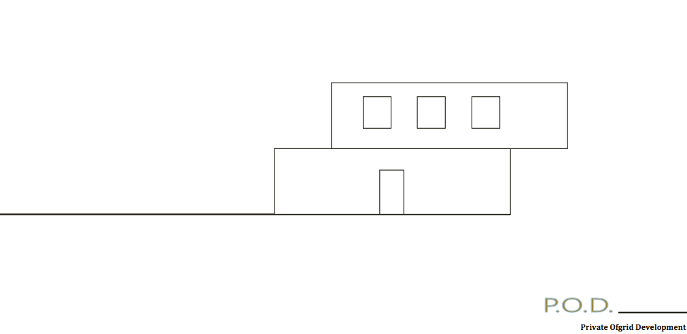
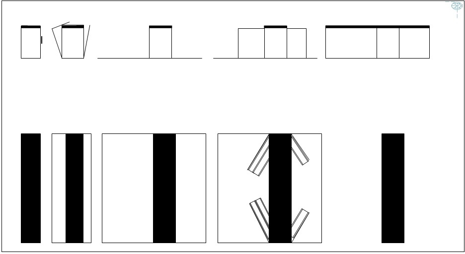
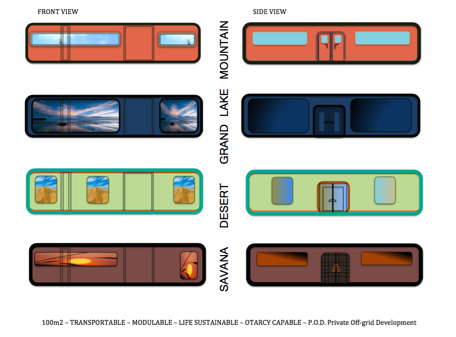
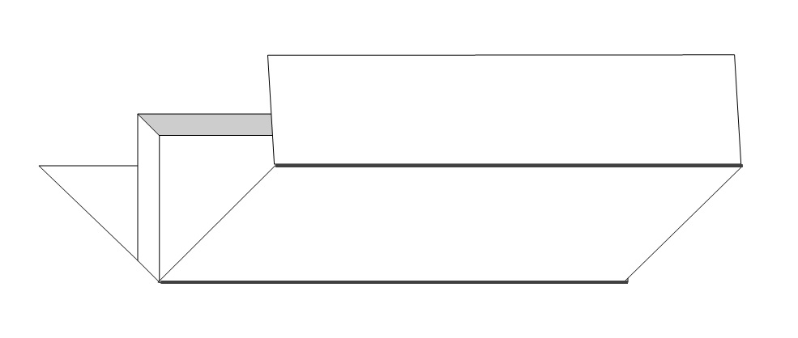

# P.O.D. Initiative

**ephemerum**

*Lifestyle without the stress of permanence management.*

Logistic

The Private Off-grid Development Initiative offer access to housing property without the burden of permanence management. You invest to own your home we propose locations and infrastructure management. Our standards follow international logistic standard offering a delivering capacity anywhere on Earth.

One fit all

When folded, P.O.D.’s Housing selected technology becomes transportable following the HQ industrial container standard. The key elements stand in purpose design and living environments. One infrastructure fits all and it is in the functional designs and environmental type that clients finds their individual solutions.

Service

The program involve a servicing solution including, P.O.D. management, relocation, P.O.D.’s share & swap, as well as emergency and relieve response services. P.O.D.’s overall Location design was intended to suits the demand of alternative living.

**3 steps to Your Home:**

1/ Select a location – Introducing ‘ephemerum’ by P.O.D.Lifestyle // PAGE

2/ Select Your Home Key Infrastructure Technology or KIT // PAGE

3/ Select Your Environment KIT – Concept Design answering Your Lifestyle // PAGE

Each environment’s require specific living set-up and apparatuses. The P.O.D.’s Initiative Location’s Design allow for these specific built-in implementation to address the special issues each environments requires for optimum living.

APPLICATION PROCESS //

1   |   SELECT A DESIGN

AFrame – CUBE – OpenSPACE

1.1  |  SELECT THE SPACE

M2 110m2/ + EXTRA & OUDOOR

2   |   OWN YOUR BLUE PRINT.

You will receive your original BLUE PRINT building the foundation of your Home.

|   MAKE YOUR FIRST PAYMENT AND COLLECT YOUR CONTRACT

3   |   SELECT YOUR PAYMENT PLAN

MONTH FIX | |     MONTH DEPOSIT

WEEK FIX | |     WEEK DEPOSIT

**$120/Month Ttl $1440/Year | Contract up to 10 Years | Minimum 1 Unit**

4   |   LINK YOUR PAYMENT MODE

Wallet  |  Cash DEPOSIT  |  Bank to Bank  |  Bank Card

SIGN YOUR CONTRACT

ORDER YOUR BLUE PRINT

## Schedule Your Payments

# [Contact us](mailto:homeofbohemian@gmail.com) 

 
### THE HOB – I.O.C.P. ALL RIGHTS RESERVED / EPHEMERUM 2023 – |

**MERCHANT-BUILDERS-TRADERS-INVESTORS// CONTACT:** 

[hehumanoperationbase@gmail.com](mailto:hehumanoperationbase@gmail.com)

My Home/ for Owner/ 1 Units minimum – 5 Units maximum/ BuyPack or Schedule Payment|

Pre-buy/ giving you first access to Units| 10 Units minimum

Passive Investment/ return on rent 13%Anm/ minimum 5 Units

Merchant/ Commission fee per Units sold 8%Anm/ minimum per Anm 36 Units

Traders/ Large volume only : minimum 100 Units/ Fees 18% Anm

Investors/ Large volume only : minimum 250 Units/ RoI – (contast Us)

REFERENCE – P.O.D. Initiative //

P.O.D. Initiative – the HOB I.O.C.P.// WP. Publication 2008-2023 |

P.O.D. – OPEN ANYWHERE ANYTIME/ เปิดได้ทุกที่ทุกเวลา/ OU TU VEUS QUAND TU VEUS/ ABIERTO EN CUALQUIER LUGAR Y EN CUALQUIER MOMENTO/ ОТКРЫТЬ ГДЕ ВСЕГДА/ مفتوح في أي مكان وفي أي وقت/

– ‘OPEN’ the P.O.D. Initiative Web Application available for Winter 2022, 2023, Worldwide.

Private Off-grid Development Services **‘ephemerum’**, own your lifestyle.

**ephemerum**

EPHEMERE VILLAGE, RESORTS & COMMUNITIES

‘ephemerum’ offer the freedom of house ownership,

without the stress of permanence management.

contact //

email/ ephemerum

EPHEMERE VILLAGE, RESORTS & COMMUNITIES

‘ephemerum’ offer the freedom of house ownership,

without the stress of permanence management.

contact //

email/  
[homeofbohemian@gmail.com](mailto:homeofbohemian@gmail.com) /  
[thehumanoperationbase@homeofbohemian.space](mailto:thehumanoperationbase@homeofbohemian.space) /

whatsApp/ +66841148235 /    thehumanoperationbase@homeofbohemian /

[DOWNLOAD: EPHEMERUM-OFFERING-2023](EPHEMERUM-OFFERING-2023.pdf)

PRIVATE OFF-GRID DEVELOPMENT – IOCP BoD P.O.D. Pitch Industry –

IOCP BoD P.O.D. Pitch Industry

IOCP BoD P.O.D. Pitch Industry

## PUBLISHED

[DOWNLOAD: IOCP-BoD-P.O.D.-Pitch-Industry-11-18](IOCP-BoD-P.O.D.-Pitch-Industry-11-18.pdf)

[DOWNLOAD: Industry-Assets-Private-OffGrid-Development-System-Development](Private-OffGrid-Development-brochure-2018.pdf)

[DOWNLOAD: Private-OffGrid-Development-brochure-2018](Industry-Assets-Private-OffGrid-Development-System-Developme.pdf)