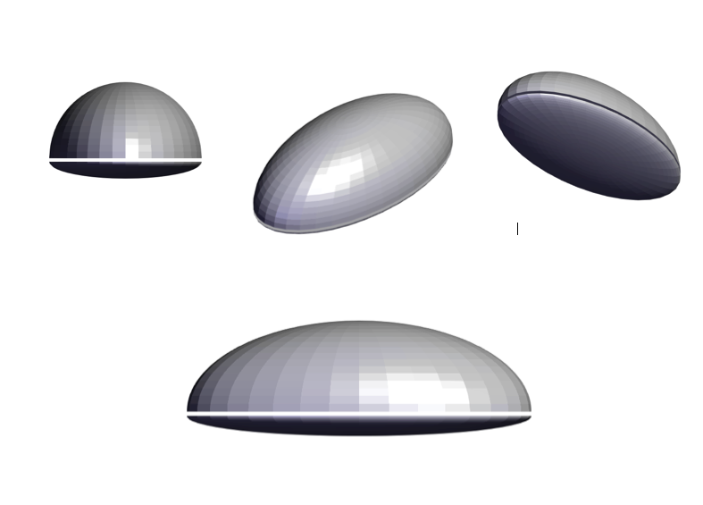
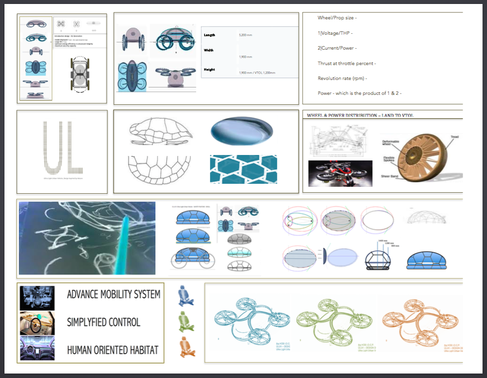
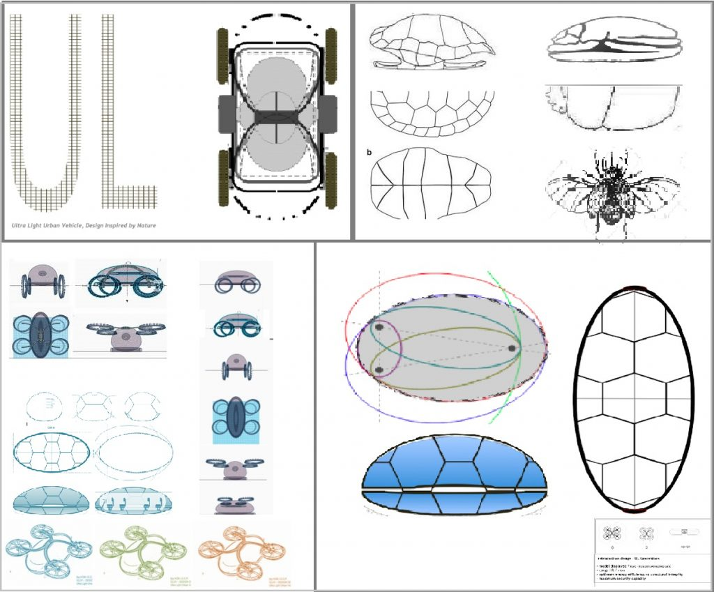
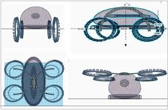
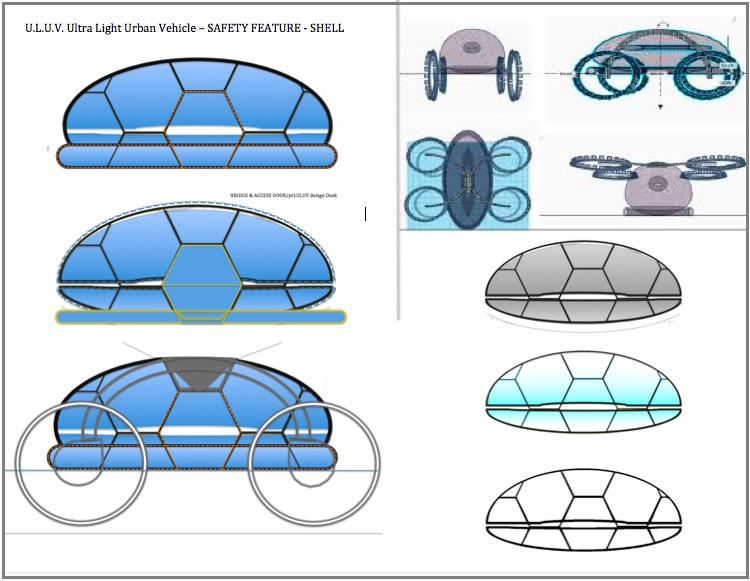

# ULUV – Ultra Light Urban Vehicle

ULUV – Ultra Light Urban Vehicle the HOB I.O.C.P., first generation of ultra-light gVTOL, eVTOL, g+VTOL//

 ULUV – INNERSHELL



## PUBLISHED

[DOWNLOAD: ULUVDESIGNDESK2007theHOBI.O.C.P.](ULUVDESIGNDESK2007theHOBI.O.C.P..pdf)